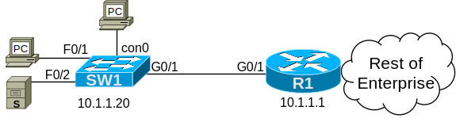

# [clab1](https://www.certskills.com/clab1/)

## Lab Requirements

Configure switch SW1 with password security for console, telnet, and privileged-mode access. Configure the passwords so that all users use the same password to reach user mode from the console, with no per-user username required. Likewise, use one password for all users who Telnet into the switch to reach user mode.

This lab begins with all the interfaces shown in Figure 1 working, with IPv4 addresses configured, and with all hosts able to ping other local hosts and hosts in the rest of the Enterprise.

The specific rules for this lab are as follows:

1. Use password “joy” to protect console access for all users to switch SW1.
2. Use password “peace” to protect Telnet access for all users to switch SW1.
3. Use password “kindness” to protect access to privileged mode for all users, using the more secure configuration option.

#### 

#### Figure 1: Network for this Lab, with Console Access Switch SW1

## Initial Configuration

Example 1 shows the non-default configuration added to switch SW1 before your work for this lab begins. Basically, the switch has already been configured with an IP address and a default gateway to allow telnet access.

    hostname SW1
    ip default-gateway 10.1.1.1
    !
    interface vlan1
     ip address 10.1.1.20 255.255.255.0

#### Example 1: SW1 Initial Configuration

## Answer Options - Click Tabs to Reveal

- Option 1: Paper/Editor
- Option 2: Cisco Packet Tracer
- Option 3: Cisco Modeling Labs

#### Option 1: Paper/Editor

You can learn a lot and strengthen real learning of the topics by creating the configuration – even without a router or switch CLI. In fact, these labs were originally built to be used solely as a paper exercise!

To answer, just think about the lab. Refer to your primary learning material for CCNA, your notes, and create the configuration on paper or in a text editor. Then check your answer versus the answer post, which is linked at the bottom of the lab, just above the comments section.

#### Option 2: Cisco Packet Tracer

You can also implement the lab using the Cisco Packet Tracer network simulator. With this option, you use Cisco’s free Packet Tracer simulator. You open a file that begins with the initial configuration already loaded. Then you implement your configuration and test to determine if it met the requirements of the lab.

[(Use this link for more information about Cisco Packet Tracer.](https://www.certskills.com/packettracer))

Use this workflow to do the labs in Cisco Packet Tracer:

1. 1. Download the .pkt file linked below.
    2. Open the .pkt file, creating a working lab with the same topology and interfaces as the lab exercise.
    3. Add your planned configuration to the lab.
    4. Test the configuration using some of the suggestions below.

[Download Packet Tracer File](https://files.certskills.com/virl/clab101.pkt)

#### Option 3: Cisco Modeling Labs

You can also implement the lab using [Cisco Modeling Labs – Personal (CML-P)](https://developer.cisco.com/modeling-labs/). CML-P (or simply CML) replaced Cisco [Virtual Internet Routing Lab (VIRL)](https://virl.cisco.com/) software in 2020, in effect serving as VIRL Version 2. If you prefer to use CML, use a similar workflow as you would use if using Cisco Packet Tracer, as follows:

1. 1. Download the CML file (filetype .yaml) linked below.
    2. Import the lab’s CML file into CML and then start the lab.
    3. Compare the lab topology and interface IDs to this lab, as they may differ (more detail below).
    4. Add your planned configuration to the lab
    5. Test the configuration using some of the suggestions below.

[Download CML File Here](https://files.certskills.com/virl/clab101.yaml)

#### Network Device Info:

This table lists the interfaces listed in the lab exercise documentation versus those used in the sample CML file.

| **Device** | **Lab Port** | **CML Port** |
| --- | --- | --- |
| SW1 | G0/1 | G0/1 |
| SW1 | F0/1 | G0/2 |
| SW1 | F0/2 | G0/3 |

#### Host device info:

This table lists host information pre-configured in CML, information that might not be required by the lab but may be useful to you.

| **Device** | **IP Address** | **Mac Address** | **User/password** |
| --- | --- | --- | --- |
| PC | 10.1.1.11 | 02:00:11:11:11:11 | cisco/cisco |
| S | 10.1.1.22 | 02:00:22:22:22:22 | cisco/cisco |

# Lab Answers Below: Spoiler Alert

---

## Lab Answers

    enable secret kindness
    !
    line con 0
     password joy
     login
    !
    line vty 0 4
     password peace
     login
    !
    line vty 5 15
     password peace
     login

#### Example: SW1 Config