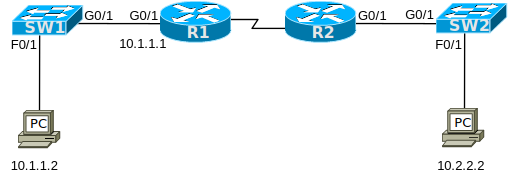

# [Switch IP 1](https://www.certskills.com/clab104/)



## Answers

    interface vlan 1
     ip address 10.1.1.20 255.255.255.0
     no shutdown
    !
    ip default-gateway 10.1.1.1

---

```
SW1#conf t
Enter configuration commands, one per line.  End with CNTL/Z.
SW1(config)#int vlan 1
SW1(config-if)#ip addr 10.1.1.20 255.255.255.0
SW1(config-if)#no shut
SW1(config-if)#exit
SW1(config)#ip default-gateway 10.1.1.1
```

```
SW1#ping 10.1.1.1

Type escape sequence to abort.
Sending 5, 100-byte ICMP Echos to 10.1.1.1, timeout is 2 seconds:
.!!!!
Success rate is 80 percent (4/5), round-trip min/avg/max = 0/3/14 ms
```

```
Cisco Packet Tracer PC Command Line 1.0
C:\>ping 10.1.1.20

Pinging 10.1.1.20 with 32 bytes of data:

Request timed out.
Reply from 10.1.1.20: bytes=32 time<1ms TTL=255
Reply from 10.1.1.20: bytes=32 time<1ms TTL=255
Reply from 10.1.1.20: bytes=32 time<1ms TTL=255

Ping statistics for 10.1.1.20:
    Packets: Sent = 4, Received = 3, Lost = 1 (25% loss),
Approximate round trip times in milli-seconds:
    Minimum = 0ms, Maximum = 0ms, Average = 0ms

C:\>
```

```
SW1#show ip interface vlan 1
Vlan1 is up, line protocol is up
  Internet address is 10.1.1.20/24
  Broadcast address is 255.255.255.255 
  Address determined by setup command 
  MTU is 1500 bytes 
  Helper address is not set
  Directed broadcast forwarding is disabled 
  Outgoing access list is not set 
  Inbound  access list is not set 
  Proxy ARP is enabled
  Local Proxy ARP is disabled 
  Security level is default 
  Split horizon is enabled 
  ICMP redirects are always sent 
  ICMP unreachables are always sent 
  ICMP mask replies are never sent 
  IP fast switching is disabled 
  IP fast switching on the same interface is disabled 
  IP Null turbo vector 
  IP multicast fast switching is disabled 
  IP multicast distributed fast switching is disabled 
  IP route-cache flags are None 
  Router Discovery is disabled 
  IP output packet accounting is disabled 
  IP access violation accounting is disabled 
  TCP/IP header compression is disabled 
  RTP/IP header compression is disabled 
  Probe proxy name replies are disabled 
  Policy routing is disabled 
  Network address translation is disable 
  WCCP Redirect outbound is disabled 
  WCCP Redirect inbound is disabled 
  WCCP Redirect exclude is disabled 
  BGP Policy Mapping is disabled 

SW1#
SW1#
SW1#
SW1#
SW1#
SW1#
SW1#
SW1#show interface vlan 1
Vlan1 is up, line protocol is up
  Hardware is CPU Interface, address is 00d0.d3aa.3c51 (bia 00d0.d3aa.3c51)
  Internet address is 10.1.1.20/24
  MTU 1500 bytes, BW 100000 Kbit, DLY 1000000 usec,
     reliability 255/255, txload 1/255, rxload 1/255
  Encapsulation ARPA, loopback not set
  ARP type: ARPA, ARP Timeout 04:00:00
  Last input 21:40:21, output never, output hang never
  Last clearing of "show interface" counters never
  Input queue: 0/75/0/0 (size/max/drops/flushes); Total output drops: 0
  Queueing strategy: fifo
  Output queue: 0/40 (size/max)
  5 minute input rate 0 bits/sec, 0 packets/sec
  5 minute output rate 0 bits/sec, 0 packets/sec
     1682 packets input, 530955 bytes, 0 no buffer
     Received 0 broadcasts (0 IP multicast)
     0 runts, 0 giants, 0 throttles
     0 input errors, 0 CRC, 0 frame, 0 overrun, 0 ignored
     563859 packets output, 0 bytes, 0 underruns
     0 output errors, 23 interface resets
     0 output buffer failures, 0 output buffers swapped out


SW1#show ip interface b 
Interface              IP-Address      OK? Method Status                Protocol 
FastEthernet0/1        unassigned      YES manual up                    up 
FastEthernet0/2        unassigned      YES manual down                  down 
FastEthernet0/3        unassigned      YES manual down                  down 
FastEthernet0/4        unassigned      YES manual down                  down 
FastEthernet0/5        unassigned      YES manual down                  down 
FastEthernet0/6        unassigned      YES manual down                  down 
FastEthernet0/7        unassigned      YES manual down                  down 
FastEthernet0/8        unassigned      YES manual down                  down 
FastEthernet0/9        unassigned      YES manual down                  down 
FastEthernet0/10       unassigned      YES manual down                  down 
FastEthernet0/11       unassigned      YES manual down                  down 
FastEthernet0/12       unassigned      YES manual down                  down 
FastEthernet0/13       unassigned      YES manual down                  down 
FastEthernet0/14       unassigned      YES manual down                  down 
FastEthernet0/15       unassigned      YES manual down                  down 
FastEthernet0/16       unassigned      YES manual down                  down 
FastEthernet0/17       unassigned      YES manual down                  down 
FastEthernet0/18       unassigned      YES manual down                  down 
FastEthernet0/19       unassigned      YES manual down                  down 
FastEthernet0/20       unassigned      YES manual down                  down 
FastEthernet0/21       unassigned      YES manual down                  down 
FastEthernet0/22       unassigned      YES manual down                  down 
FastEthernet0/23       unassigned      YES manual down                  down 
FastEthernet0/24       unassigned      YES manual down                  down 
GigabitEthernet0/1     unassigned      YES manual up                    up 
GigabitEthernet0/2     unassigned      YES manual down                  down 
Vlan1                  10.1.1.20       YES manual up                    up

SW1#sh run
Building configuration...

Current configuration : 1237 bytes
!
version 15.0
no service timestamps log datetime msec
no service timestamps debug datetime msec
no service password-encryption
!
hostname SW1
!
enable secret 5 $1$mERr$hx5rVt7rPNoS4wqbXKX7m0
!
!
!
!
!
!
spanning-tree mode pvst
spanning-tree extend system-id
!
interface FastEthernet0/1
!
interface FastEthernet0/2
!
interface FastEthernet0/3
!
interface FastEthernet0/4
!
interface FastEthernet0/5
!
interface FastEthernet0/6
!
interface FastEthernet0/7
!
interface FastEthernet0/8
!
interface FastEthernet0/9
!
interface FastEthernet0/10
!
interface FastEthernet0/11
!
interface FastEthernet0/12
!
interface FastEthernet0/13
!
interface FastEthernet0/14
!
interface FastEthernet0/15
!
interface FastEthernet0/16
!
interface FastEthernet0/17
!
interface FastEthernet0/18
!
interface FastEthernet0/19
!
interface FastEthernet0/20
!
interface FastEthernet0/21
!
interface FastEthernet0/22
!
interface FastEthernet0/23
!
interface FastEthernet0/24
!
interface GigabitEthernet0/1
!
interface GigabitEthernet0/2
!
interface Vlan1
 ip address 10.1.1.20 255.255.255.0
!
ip default-gateway 10.1.1.1
!
!
!
!
line con 0
 password certskills
 login
!
line vty 0 4
 password certskills
 login
line vty 5 15
 password certskills
 login
!
!
!
!
end
```