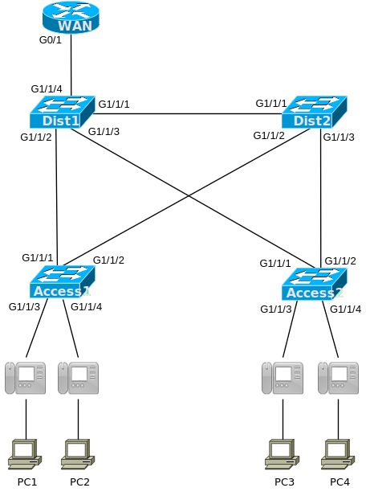

# [clab113](https://www.certskills.com/clab113/)



## Requirements
The network uses four layer 2 switches: two distribution switches and two access switches. The access switch ports connect to two devices in succession in a typical user cubicle: first to an IP phone and then to a desktop computer.  Your job is to configure the two VLANs (a data VLAN and a voice VLAN), placing all phones in the voice VLAN and all PCs in the data VLAN. And you need to make the VLANs work so that they can send and receive traffic off-site through the WAN router shown at the top of the figure.

The specific rules for this lab are:

- Assign the PCs in the figure to use VLAN 10 as their data VLAN.
- Assign the IP Phones in the figure to use VLAN 20 as their voice VLAN.
- Configure VLANs correctly so that traffic in both VLAN 10 and 20 can flow through all four switches and up to the router (which acts as their default gateway.)

Assumptions:
- All device interfaces shown in the lab are up and working.
- VLAN trunking is working between the switches.
- VTP is in transparent mode or off.
- All four switches are acting as layer 2 switches and not as layer 3 switches.
- The WAN router is already configured for router-on-a-stick (see the initial configuration.)

## Initial Configuration

Examples 1, 2, 3, and 4 show the beginning configuration state of Dist1, Dist2, Access1, and Access2.

    hostname Dist1
    !
    vtp mode transparent
    !
    interface GigabitEthernet1/1/1
     switchport trunk encapsulation dot1q
     switchport mode trunk
    !
    interface GigabitEthernet1/1/2
     switchport trunk encapsulation dot1q
     switchport mode trunk
    !
    interface GigabitEthernet1/1/3
     switchport trunk encapsulation dot1q
     switchport mode trunk
    !
    interface GigabitEthernet1/1/4
     switchport trunk encapsulation dot1q
     switchport mode trunk

#### Example 1: Dist1 Config

    hostname Dist2
    !
    vtp mode transparent
    !
    interface GigabitEthernet1/1/1
     switchport trunk encapsulation dot1q
     switchport mode trunk
    !
    interface GigabitEthernet1/1/2
     switchport trunk encapsulation dot1q
     switchport mode trunk
    !
    interface GigabitEthernet1/1/3
     switchport trunk encapsulation dot1q
     switchport mode trunk
    !
    interface GigabitEthernet1/1/4
     switchport trunk encapsulation dot1q
     switchport mode trunk

#### Example 2: Dist2 Config

    hostname Access1
    !
    vtp mode transparent
    !
    interface GigabitEthernet1/1/1
     switchport trunk encapsulation dot1q
     switchport mode trunk
    !
    interface GigabitEthernet1/1/2
     switchport trunk encapsulation dot1q
     switchport mode trunk
    !
    interface GigabitEthernet1/1/3
    !
    interface GigabitEthernet1/1/4

#### Example 3: Access1 Config

    hostname Access2
    !
    vtp mode transparent
    !
    interface GigabitEthernet1/1/1
     switchport trunk encapsulation dot1q
     switchport mode trunk
    !
    interface GigabitEthernet1/1/2
     switchport trunk encapsulation dot1q
     switchport mode trunk
    !
    interface GigabitEthernet1/1/3
    !
    interface GigabitEthernet1/1/4

#### Example 4: Access2 Config

    hostname WAN
    !
    interface gigabitEthernet0/1
     no shutdown
    !
    interface GigabitEthernet0/1.10
     encapsulation dot1q 10
     ip address 10.1.1.99 255.255.255.0
    !
    interface GigabitEthernet0/1.20
     encapsulation dot1q 20
     ip address 10.1.20.99 255.255.255.0

#### Example 5: (Relevant) WAN Router Config

---
Step 1. Use the vlan vlan-id command in global configuration mode to create the data and voice VLANs if they do not already exist on the switch.
Step 2. Configure the data VLAN like an access VLAN, as usual:

Use the interface type number command in global configuration mode to move into interface configuration mode.
Use the switchport access vlan id-number command in interface configuration mode to define the data VLAN.
Use the switchport mode access command in interface configuration mode to make this port always operate in access mode (that is, to not trunk).

Step 3. Use the switchport voice vlan id-number command in interface configuration mode to set the voice VLAN ID.


```
Access1#conf t
Enter configuration commands, one per line.  End with CNTL/Z.
Access1(config)#vlan 10
Access1(config-vlan)#vlan 20
Access1(config-vlan)#int r g1/1/3-4
Access1(config-if-range)#switchport mode access
Access1(config-if-range)#switchport access vlan 10
Access1(config-if-range)#switc
Access1(config-if-range)#switchport voice vlan 20
Access1(config-if-range)#end
Access1#
%SYS-5-CONFIG_I: Configured from console by console

Access1#sh int g1/1/3 sw
Name: Gig1/1/3
Switchport: Enabled
Administrative Mode: static access
Operational Mode: static access
Administrative Trunking Encapsulation: dot1q
Operational Trunking Encapsulation: native
Negotiation of Trunking: Off
Access Mode VLAN: 10 (VLAN0010)
Trunking Native Mode VLAN: 1 (default)
Voice VLAN: 20
Administrative private-vlan host-association: none
Administrative private-vlan mapping: none
Administrative private-vlan trunk native VLAN: none
Administrative private-vlan trunk encapsulation: dot1q
Administrative private-vlan trunk normal VLANs: none
Administrative private-vlan trunk private VLANs: none
Operational private-vlan: none
Trunking VLANs Enabled: All
Pruning VLANs Enabled: 2-1001
Capture Mode Disabled
Capture VLANs Allowed: ALL
Protected: false
Appliance trust: none


Access2#conf t
Enter configuration commands, one per line.  End with CNTL/Z.
Access2(config)#vlan 10
Access2(config-vlan)#vlan 20
Access2(config-vlan)#int r g1/1/3-4
Access2(config-if-range)#switchport access vlan 10
Access2(config-if-range)#switchport voice vlan 20
Access2(config-if-range)#switchport mode access
Access2(config-if-range)#end
Access2#
%SYS-5-CONFIG_I: Configured from console by console

Access2#sh int g1/1/3 sw
Name: Gig1/1/3
Switchport: Enabled
Administrative Mode: static access
Operational Mode: static access
Administrative Trunking Encapsulation: dot1q
Operational Trunking Encapsulation: native
Negotiation of Trunking: Off
Access Mode VLAN: 10 (VLAN0010)
Trunking Native Mode VLAN: 1 (default)
Voice VLAN: 20
Administrative private-vlan host-association: none
Administrative private-vlan mapping: none
Administrative private-vlan trunk native VLAN: none
Administrative private-vlan trunk encapsulation: dot1q
Administrative private-vlan trunk normal VLANs: none
Administrative private-vlan trunk private VLANs: none
Operational private-vlan: none
Trunking VLANs Enabled: All
Pruning VLANs Enabled: 2-1001
Capture Mode Disabled
Capture VLANs Allowed: ALL
Protected: false
Appliance trust: none

Access2#sh int g1/1/4 sw
Name: Gig1/1/4
Switchport: Enabled
Administrative Mode: static access
Operational Mode: static access
Administrative Trunking Encapsulation: dot1q
Operational Trunking Encapsulation: native
Negotiation of Trunking: Off
Access Mode VLAN: 10 (VLAN0010)
Trunking Native Mode VLAN: 1 (default)
Voice VLAN: 20
Administrative private-vlan host-association: none
Administrative private-vlan mapping: none
Administrative private-vlan trunk native VLAN: none
Administrative private-vlan trunk encapsulation: dot1q
Administrative private-vlan trunk normal VLANs: none
Administrative private-vlan trunk private VLANs: none
Operational private-vlan: none
Trunking VLANs Enabled: All
Pruning VLANs Enabled: 2-1001
Capture Mode Disabled
Capture VLANs Allowed: ALL
Protected: false
Appliance trust: none
```

```
Dist1#conf t
Enter configuration commands, one per line.  End with CNTL/Z.
Dist1(config)#vlan 10
Dist1(config-vlan)#vlan 20

Dist2#conf t
Enter configuration commands, one per line.  End with CNTL/Z.
Dist2(config)#vlan 10
Dist2(config-vlan)#vlan 20
```
