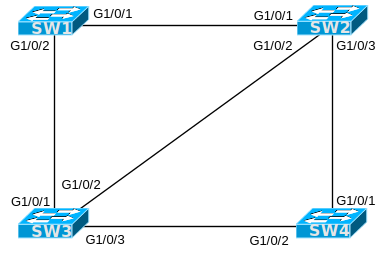

# [clab115](https://www.certskills.com/clab115/)

## Initial Configuration

Examples 1, 2, 3, and 4 show the beginning configuration state of SW1, SW2, SW3, and SW4.

    hostname SW1

#### Example 1: SW1 Config

    hostname SW2

#### Example 2: SW2 Config

    hostname SW3

#### Example 3: SW3 Config

    hostname SW4

#### Example 4: SW4 Config

### Config Lab Intro Video

<iframe id="iframe-player-10" data-id="10" class="youtube-player" width="1140" height="642" src="https://www.youtube.com/embed/ZwkVZMSA1nY?version=3&#038;rel=1&#038;showsearch=0&#038;showinfo=1&#038;iv_load_policy=1&#038;fs=1&#038;hl=en-US&#038;autohide=2&#038;wmode=transparent" allowfullscreen="true" style="border:0;" sandbox="allow-scripts allow-same-origin allow-popups allow-presentation allow-popups-to-escape-sandbox"></iframe>

The above lab intro – the text, figures, and initial configuration – tells you all you need to know. But if you want a little more, with a little different slant on what to do in this lab, watch this lab intro video!

## Answer Options - Click Tabs to Reveal

- Option 1: Paper/Editor
- Option 2: Cisco Packet Tracer
- Option 3: Cisco Modeling Labs

#### Option 1: Paper/Editor

You can learn a lot and strengthen real learning of the topics by creating the configuration – even without a router or switch CLI. In fact, these labs were originally built to be used solely as a paper exercise!

To answer, just think about the lab. Refer to your primary learning material for CCNA, your notes, and create the configuration on paper or in a text editor. Then check your answer versus the answer post, which is linked at the bottom of the lab, just above the comments section.

#### Option 2: Cisco Packet Tracer

You can also implement the lab using the Cisco Packet Tracer network simulator. With this option, you use Cisco’s free Packet Tracer simulator. You open a file that begins with the initial configuration already loaded. Then you implement your configuration and test to determine if it met the requirements of the lab.

[(Use this link for more information about Cisco Packet Tracer.](https://www.certskills.com/packettracer))

Use this workflow to do the labs in Cisco Packet Tracer:

1. Download the .pkt file linked below.
2. Open the .pkt file, creating a working lab with the same topology and interfaces as the lab exercise.
3. Add your planned configuration to the lab.
4. Test the configuration using some of the suggestions below.

[Download this lab’s Packet Tracer File](https://files.certskills.com/virl/clab115.pkt)

#### Option 3: Cisco Modeling Labs

## This Lab Supports Both CML-Free and CML-Personal!!!

The downloadable file listed here works in both CML-P or CML-F because it uses the IOL (router) and IOL-L2 (switch) reference platform images supported by both products as of CML V2.8. Note that these images also require less CPU and RAM than the other CML-P options.

Use the same general workflow as with Cisco Packet Tracer, as follows:

1. Download the CML file (filetype .yaml) linked below.
2. Import the lab’s CML file into CML.
3. Start the lab in CML.
4. Compare the CML lab topology and interface IDs to this lab Blog page, as they may differ (more detail below).
5. Add your planned configuration to the lab, adjusting for interface ID differences.
6. Test the configuration using some of the suggestions below.

[Download this lab’s CML file!](https://files.certskills.com/virl/clab115-free.yaml)

#### Interface ID Differences:

The lab diagrams on this page use interface IDs (IIDs) that match the Packet Tracer version of the lab. When using CML, adjust the lab IIDs based on this table. Also, note that the IOL and IOL-L2 images used by the supplied CML file support only the “Ethernet” interface type, and not “FastEthernet” or “GigabitEthernet”.

The conventions for this lab are:

- Gigabit IIDs with three numbers, in the pattern of G1/0/x, become an Ethernet interface type in the pattern E0/x, respectively.  (For example, **G**1/0/**1** becomes **E**0/**1**.)

| **DeviceType** | **Port Shown in Lab** | **CML Port** |
| --- | --- | --- |
| Switch | G1/0/1 | E0/1 |
| Switch | G1/0/2 | E0/2 |
| Switch | G1/0/3 | E0/3 |

# Lab Answers Below: Spoiler Alert

---

## Answers

#### Figure 1: Four Switches with Trunks

    interface GigabitEthernet1/0/1
      switchport mode dynamic desirable
    !
    interface GigabitEthernet1/0/2
      switchport mode dynamic desirable

#### Example 5: SW1 Config

    interface GigabitEthernet1/0/2
      switchport mode trunk
      switchport nonegotiate

#### Example 6: SW2 Config

    Interface GigabitEthernet1/0/2
      switchport mode trunk
      switchport nonegotiate

#### Example 7: SW3 Config

    Interface GigabitEthernet1/0/1
      switchport mode trunk
    !
    interface GigabitEthernet1/0/2
      switchport mode trunk

#### Example 8: SW4 Config