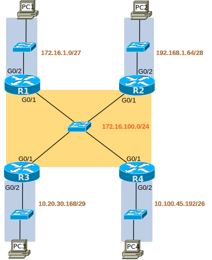

# [clab117](https://www.certskills.com/clab117/)

## Initial Configuration

Examples 1, 2, 3, and 4 show the beginning configuration state of R1, R2, R3, and R4.

    hostname R1
    !
    interface GigabitEthernet0/1
     no shutdown
    !
    interface GigabitEthernet0/2
     no shutdown

#### Example 1: R1 Config

    hostname R2
    !
    interface GigabitEthernet0/1
     no shutdown
    !
    interface GigabitEthernet0/2
     no shutdown

#### Example 2: R2 Config

    hostname R3
    !
    interface GigabitEthernet0/1
     no shutdown
    !
    interface GigabitEthernet0/2
     no shutdown

#### Example 3: R3 Config

    hostname R4
    !
    interface GigabitEthernet0/1
     no shutdown
    !
    interface GigabitEthernet0/2
     no shutdown

#### Example 4: R4 Config

## Answer Options - Click Tabs to Reveal

- Option 1: Paper/Editor
- Option 2: Cisco Packet Tracer
- Option 3: Cisco Modeling Labs

#### Option 1: Paper/Editor

You can learn a lot and strengthen real learning of the topics by creating the configuration – even without a router or switch CLI. In fact, these labs were originally built to be used solely as a paper exercise!

To answer, just think about the lab. Refer to your primary learning material for CCNA, your notes, and create the configuration on paper or in a text editor. Then check your answer versus the answer post, which is linked at the bottom of the lab, just above the comments section.

#### Option 2: Cisco Packet Tracer

You can also implement the lab using the Cisco Packet Tracer network simulator. With this option, you use Cisco’s free Packet Tracer simulator. You open a file that begins with the initial configuration already loaded. Then you implement your configuration and test to determine if it met the requirements of the lab.

[(Use this link for more information about Cisco Packet Tracer.](https://www.certskills.com/packettracer))

Use this workflow to do the labs in Cisco Packet Tracer:

1. Download the .pkt file linked below.
2. Open the .pkt file, creating a working lab with the same topology and interfaces as the lab exercise.
3. Add your planned configuration to the lab.
4. Test the configuration using some of the suggestions below.

[Download this lab’s Packet Tracer File](https://files.certskills.com/virl/clab117.pkt)

#### Option 3: Cisco Modeling Labs

#### This Lab Supports Both CML-Free and CML-Personal!!!

The downloadable file listed here works in both CML-P or CML-F because it uses the IOL (router) and IOL-L2 (switch) reference platform images supported by both products as of CML V2.8. Note that these images also require less CPU and RAM than the other CML-P options.

Use the same general workflow as with Cisco Packet Tracer, as follows:

1. Download the CML file (filetype .yaml) linked below.
2. Import the lab’s CML file into CML.
3. Start the lab in CML.
4. Compare the CML lab topology and interface IDs to this lab Blog page, as they may differ (more detail below).
5. Add your planned configuration to the lab, adjusting for interface ID differences.
6. Test the configuration using some of the suggestions below.

[Download this lab’s CML file!](https://files.certskills.com/virl/clab117-free.yaml)

See below for an alternate CML file.

#### Interface ID Differences:

The lab diagrams on this page use interface IDs (IIDs) that match the Packet Tracer version of the lab. When using CML, adjust the lab IIDs based on this table. Also, note that the IOL and IOL-L2 images used by the supplied CML file support only the “Ethernet” interface type, and not “FastEthernet” or “GigabitEthernet”. The conventions for this lab are:

- Gigabit IIDs become Ethernet IIDs, but use the same numbers. For example, G0/1 becomes E0/1.

| **Lab Port** | **CML Port** |
| --- | --- |
| G0/1 | E0/1 |
| G0/2 | E0/2 |

#### Alternate CML File w/ “Router as Many Hosts” Feature

The lab diagram for this lab has:

- 4 Routers
- 5 Switches
- 4 hosts

However, CML-Free allows only five active nodes. The lab must use four active routers to be meaningful. To overcome that limit, the CML file uses unmanaged switches, which act as switches with all ports as access ports in the same VLAN. Unmanaged switches do not count against the five-node limit. The CML file linked earlier in this section omits the four hosts. As a result of these two choices, the earlier CML file uses four nodes that count against the five-node limit, so you can run the lab in CML-Free.

If you want to use a CML file that includes the hosts, use the file linked below. It uses the same design, but adds one router. That one router mimics all four hosts so the lab does not exceed the five-node limit. I call this method “One-Router-as-Many-Hosts”, which uses the router VRF Lite feature. To learn about that method, look to the following videos:

- - [Overcome the 5-Node Limit w/ Router-as-Many-Hosts](https://youtu.be/8LAmPxqa1Go)
    - [See CML-Free Node Count Avoidance Tricks in Action!](https://youtu.be/oHqV9tvT2-g)

Using this feature can be a little tricky, so you will likely want to watch both the above videos before using it. The file is linked below.

[Download this lab’s CML file – which includes hosts!](https://files.certskills.com/virl/clab117-free-w-hosts.yaml)

# Lab Answers Below: Spoiler Alert

---

## Answers

#### Figure 1: Four Switches with Trunks

    interface GigabitEthernet0/1
     ip address 172.16.100.1 255.255.255.0
    !
    interface GigabitEthernet0/2
     ip address 172.16.1.30 255.255.255.224

#### Example 5: R1 Config

    interface GigabitEthernet0/1
     ip address 172.16.100.2 255.255.255.0
    !
    interface GigabitEthernet0/2
     ip address 192.168.1.78 255.255.255.240

#### Example 2: R2 Config

    interface GigabitEthernet0/1
     ip address 172.16.100.3 255.255.255.0
    !
    interface GigabitEthernet0/2
     ip address 10.20.30.174 255.255.255.248

#### Example 3: R3 Config

    interface GigabitEthernet0/1
     ip address 172.16.100.4 255.255.255.0
    !
    interface GigabitEthernet0/2
     ip address 10.100.45.254 255.255.255.192

#### Example 4: R4 Config