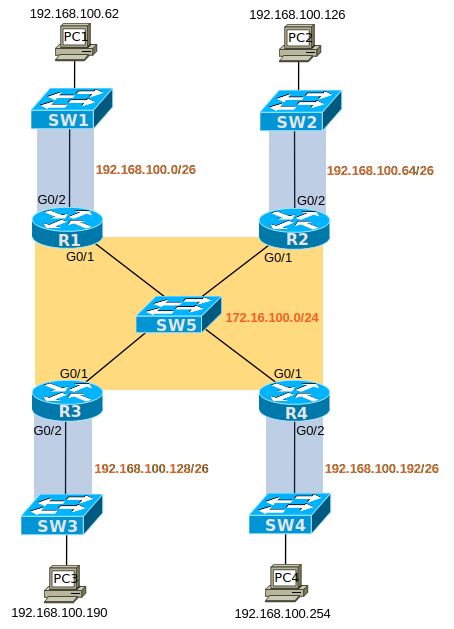

# [clab119](https://www.certskills.com/clab119/)

## Initial Configuration

Examples 1, 2, 3, and 4 show the beginning configuration state of R1, R2, R3, and R4.

    hostname R1
    !
    interface GigabitEthernet0/1
     ip address 172.16.100.1 255.255.255.0
     no shutdown
    !
    interface GigabitEthernet0/2
     ip address 192.168.100.1 255.255.255.192
     no shutdown

#### Example 1: R1 Config

    hostname R2
    !
    interface GigabitEthernet0/1
     ip address 172.16.100.2 255.255.255.0
     no shutdown
    !
    interface GigabitEthernet0/2
     ip address 192.168.100.65 255.255.255.192
     no shutdown

#### Example 2: R2 Config

    hostname R3
    !
    interface GigabitEthernet0/1
     ip address 172.16.100.3 255.255.255.0
     no shutdown
    !
    interface GigabitEthernet0/2
     ip address 192.168.100.129 255.255.255.192
     no shutdown

#### Example 3: R3 Config

    hostname R4
    !
    interface GigabitEthernet0/1
     ip address 172.16.100.4 255.255.255.0
     no shutdown
    !
    interface GigabitEthernet0/2
     ip address 192.168.100.193 255.255.255.192
     no shutdown

#### Example 4: R4 Config

## Answer Options - Click Tabs to Reveal

- Option 1: Paper/Editor
- Option 2: Cisco Packet Tracer
- Option 3: Cisco Modeling Labs

#### Option 1: Paper/Editor

You can learn a lot and strengthen real learning of the topics by creating the configuration – even without a router or switch CLI. In fact, these labs were originally built to be used solely as a paper exercise!

To answer, just think about the lab. Refer to your primary learning material for CCNA, your notes, and create the configuration on paper or in a text editor. Then check your answer versus the answer post, which is linked at the bottom of the lab, just above the comments section.

#### Option 2: Cisco Packet Tracer

You can also implement the lab using the Cisco Packet Tracer network simulator. With this option, you use Cisco’s free Packet Tracer simulator. You open a file that begins with the initial configuration already loaded. Then you implement your configuration and test to determine if it met the requirements of the lab.

[(Use this link for more information about Cisco Packet Tracer.](https://www.certskills.com/packettracer))

Use this workflow to do the labs in Cisco Packet Tracer:

1. Download the .pkt file linked below.
2. Open the .pkt file, creating a working lab with the same topology and interfaces as the lab exercise.
3. Add your planned configuration to the lab.
4. Test the configuration using some of the suggestions below.

[Download this lab’s Packet Tracer File](https://files.certskills.com/virl/clab119.pkt)

#### Option 3: Cisco Modeling Labs

You can also implement the lab using [Cisco Modeling Labs – Personal (CML-P)](https://developer.cisco.com/modeling-labs/). CML-P (or simply CML) replaced Cisco [Virtual Internet Routing Lab (VIRL)](https://virl.cisco.com/) software in 2020, in effect serving as VIRL Version 2.

If you prefer to use CML, use a similar workflow as you would use if using Cisco Packet Tracer, as follows:

1. Download the CML file (filetype .yaml) linked below.
2. Import the lab’s CML file into CML and then start the lab.
3. Compare the lab topology and interface IDs to this lab, as they may differ (more detail below).
4. Add your planned configuration to the lab.
5. Test the configuration using some of the suggestions below.

[Download this lab’s CML file!](https://files.certskills.com/virl/clab119.yaml)

#### Network Device Info:

The CML topology matches this lab topology exactly. The host info does as well.

#### Host device info:

This table lists host information pre-configured in CML information that might not be required by the lab but may be useful to you.

| **Device** | **IP Address** | **Mac Address** | **User/password** |
| --- | --- | --- | --- |
| PC1 | 192.168.100.62 | 02:00:11:11:11:11 | cisco/cisco |
| PC2 | 192.168.100.126 | 02:00:22:22:22:22 | cisco/cisco |
| PC3 | 192.168.100.190 | 02:00:33:33:33:33 | cisco/cisco |
| PC4 | 192.168.100.254 | 02:00:44:44:44:44 | cisco/cisco |

# Lab Answers Below: Spoiler Alert

---

## Answers

#### Figure 1: Four Switches with Trunks

    !
    ip route 192.168.100.64 255.255.255.192 172.16.100.2
    ip route 192.168.100.128 255.255.255.192 172.16.100.3
    ip route 192.168.100.192 255.255.255.192 172.16.100.4

#### Example 5: R1 Config

    !
    ip route 192.168.100.0 255.255.255.192 172.16.100.1
    ip route 192.168.100.128 255.255.255.192 172.16.100.3
    ip route 192.168.100.192 255.255.255.192 172.16.100.4

#### Example 6: R2 Config

    !
    ip route 192.168.100.0 255.255.255.192 172.16.100.1
    ip route 192.168.100.64 255.255.255.192 172.16.100.2
    ip route 192.168.100.192 255.255.255.192 172.16.100.4

#### Example 7: R3 Config

    !
    ip route 192.168.100.0 255.255.255.192 172.16.100.1
    ip route 192.168.100.64 255.255.255.192 172.16.100.2
    ip route 192.168.100.128 255.255.255.192 172.16.100.3

#### Example 8: R4 Config