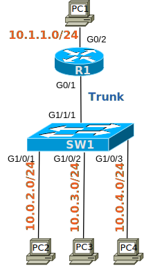

# [clab120](https://www.certskills.com/clab120/)

## Initial Configuration

Examples 1 and 2 show the beginning configuration state of R1 and SW1.

    hostname R1
    !
    interface GigabitEthernet0/1
     no shutdown
    !
    interface GigabitEthernet0/2
     ip address 10.1.1.1 255.255.255.0
     no shutdown

#### Example 1: R1 Config

    hostname SW1
    !
    vlan 20
    !
    vlan 30
    !
    interface GigabitEthernet1/0/1
     switchport mode access
    !
    interface GigabitEthernet1/0/2
     switchport access vlan 20
     switchport mode access
    !
    interface GigabitEthernet1/0/3
     switchport access vlan 30
     switchport mode access

#### Example 2: SW1 Config

### Config Lab Intro Video

<iframe id="iframe-player-10" data-id="10" title="Config Lab Review: &quot;Router-on-a-Stick Basics 1&quot;" width="1140" height="641" src="https://www.youtube.com/embed/N6dfmfO-3Dw?feature=oembed" frameborder="0" allow="accelerometer; autoplay; clipboard-write; encrypted-media; gyroscope; picture-in-picture; web-share" referrerpolicy="strict-origin-when-cross-origin" allowfullscreen></iframe>

The above lab intro – the text, figures, and initial configuration – tells you all you need to know. But if you want a little more, with a little different slant on what to do in this lab, watch this lab intro video!

## Answer Options - Click Tabs to Reveal

- Option 1: Paper/Editor
- Option 2: Cisco Packet Tracer
- Option 3: Cisco Modeling Labs

#### Option 1: Paper/Editor

You can learn a lot and strengthen real learning of the topics by creating the configuration – even without a router or switch CLI. In fact, these labs were originally built to be used solely as a paper exercise!

To answer, just think about the lab. Refer to your primary learning material for CCNA, your notes, and create the configuration on paper or in a text editor. Then check your answer versus the answer post, which is linked at the bottom of the lab, just above the comments section.

#### Option 2: Cisco Packet Tracer

You can also implement the lab using the Cisco Packet Tracer network simulator. With this option, you use Cisco’s free Packet Tracer simulator. You open a file that begins with the initial configuration already loaded. Then you implement your configuration and test to determine if it met the requirements of the lab.

[(Use this link for more information about Cisco Packet Tracer.](https://www.certskills.com/packettracer))

Use this workflow to do the labs in Cisco Packet Tracer:

1. Download the .pkt file linked below.
2. Open the .pkt file, creating a working lab with the same topology and interfaces as the lab exercise.
3. Add your planned configuration to the lab.
4. Test the configuration using some of the suggestions below.

[Download this lab’s Packet Tracer File](https://files.certskills.com/virl/clab120.pkt)

#### Option 3: Cisco Modeling Labs

You can also implement the lab using [Cisco Modeling Labs – Personal (CML-P)](https://developer.cisco.com/modeling-labs/). CML-P (or simply CML) replaced Cisco [Virtual Internet Routing Lab (VIRL)](https://virl.cisco.com/) software in 2020, in effect serving as VIRL Version 2.

If you prefer to use CML, use a similar workflow as you would use if using Cisco Packet Tracer, as follows:

1. Download the CML file (filetype .yaml) linked below.
2. Import the lab’s CML file into CML and then start the lab.
3. Compare the lab topology and interface IDs to this lab, as they may differ (more detail below).
4. Add your planned configuration to the lab.
5. Test the configuration using some of the suggestions below.

[Download this lab’s CML file!](https://files.certskills.com/virl/clab120.yaml)

#### Network Device Info:

This table lists the interfaces listed in the lab exercise documentation versus those used in the sample CML file.

| **Device** | **Lab Port** | **CML Port** |
| --- | --- | --- |
| SW1 | G1/1/1 | G1/0 |
| SW1 | G1/0/1 | G0/1 |
| SW1 | G1/0/2 | G0/2 |
| SW1 | G1/0/3 | G0/3 |

#### Host device info:

This table lists host information pre-configured in CML, information that might not be required by the lab but may be useful to you.

| **Device** | **IP Address** | **User/password** |
| --- | --- | --- |
| PC1 | 10.1.1.100 | cisco/cisco |
| PC2 | 10.0.2.100 | cisco/cisco |
| PC3 | 10.0.3.100 | cisco/cisco |
| PC4 | 10.0.4.100 | cisco/cisco |

# Lab Answers Below: Spoiler Alert

---

## Answers

#### Figure 1: ROAS with three VLAN’s

    interface GigabitEthernet0/1.1
     encapsulation dot1Q 1 native
     ip address 10.0.2.1 255.255.255.0
    !
    interface GigabitEthernet0/1.2
     encapsulation dot1Q 20
     ip address 10.0.3.1 255.255.255.0
    !
    interface GigabitEthernet0/1.3
     encapsulation dot1Q 30
     ip address 10.0.4.1 255.255.255.0

#### Example 3: R1 Config

    interface GigabitEthernet1/1/1
    ! This next line is needed only in older switches... and in CML/VIRL/PT
     switchport trunk encapsulation dot1q
     switchport mode trunk

#### Example 4: SW1 Config

Older switches that support both ISL and 802.1Q require the **switchport trunk encapsulation dot1q** command, which sets the specific type of trunking header. Newer switches support only the 802.1Q standard and will reject that command. So uncomment and use the **switchport trunk encapsulation dot1q** command as needed.