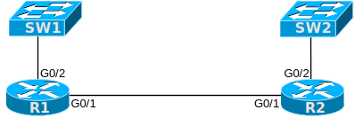

# [clab131](https://www.certskills.com/clab131/)

## Initial Configuration

Example 1 and 2 show the beginning configuration state of R1 and R2.

    hostname R1
    !
    ipv6 unicast-routing
    !
    interface GigabitEthernet0/1
     no shutdown
    !
    interface GigabitEthernet0/2
     no shutdown

#### Example 1: R1 Config

    hostname R2
    !
    ipv6 unicast-routing
    !
    interface GigabitEthernet0/1
     no shutdown
    !
    interface GigabitEthernet0/2
     no shutdown

#### Example 2: R2 Config

### Config Lab Intro Video

<iframe id="iframe-player-10" data-id="10" title="CCNA Reading Break" width="1140" height="641" src="https://www.youtube.com/embed/videoseries?list=PLhDAmDsTz9Xe2JrZqmPlMjYi5vsNAILG3" frameborder="0" allow="accelerometer; autoplay; clipboard-write; encrypted-media; gyroscope; picture-in-picture; web-share" referrerpolicy="strict-origin-when-cross-origin" allowfullscreen></iframe>

Coming in January!!!!!

The above lab intro – the text, figures, and initial configuration – tells you all you need to know. But if you want a little more, with a little different slant on what to do in this lab, watch this lab intro video!

## Answer Options - Click Tabs to Reveal

- Option 1: Paper/Editor
- Option 2: Cisco Packet Tracer
- Option 3: Cisco Modeling Labs

#### Option 1: Paper/Editor

You can learn a lot and strengthen real learning of the topics by creating the configuration – even without a router or switch CLI. In fact, these labs were originally built to be used solely as a paper exercise!

To answer, just think about the lab. Refer to your primary learning material for CCNA, your notes, and create the configuration on paper or in a text editor. Then check your answer versus the answer post, which is linked at the bottom of the lab, just above the comments section.

#### Option 2: Cisco Packet Tracer

You can also implement the lab using the Cisco Packet Tracer network simulator. With this option, you use Cisco’s free Packet Tracer simulator. You open a file that begins with the initial configuration already loaded. Then you implement your configuration and test to determine if it met the requirements of the lab.

[(Use this link for more information about Cisco Packet Tracer.](https://www.certskills.com/packettracer))

Use this workflow to do the labs in Cisco Packet Tracer:

1. Download the .pkt file linked below.
2. Open the .pkt file, creating a working lab with the same topology and interfaces as the lab exercise.
3. Add your planned configuration to the lab.
4. Test the configuration using some of the suggestions below.

[Download this lab’s Packet Tracer File](https://files.certskills.com/virl/clab131.pkt)

#### Option 3: Cisco Modeling Labs

You can also implement the lab using [Cisco Modeling Labs – Personal (CML-P)](https://developer.cisco.com/modeling-labs/). CML-P (or simply CML) replaced Cisco [Virtual Internet Routing Lab (VIRL)](https://virl.cisco.com/) software in 2020, in effect serving as VIRL Version 2.

If you prefer to use CML, use a similar workflow as you would use if using Cisco Packet Tracer, as follows:

1. Download the CML file (filetype .yaml) linked below.
2. Import the lab’s CML file into CML and then start the lab.
3. Compare the lab topology and interface IDs to this lab, as they may differ (more detail below).
4. Add your planned configuration to the lab.
5. Test the configuration using some of the suggestions below.

[Download this lab’s CML file!](https://files.certskills.com/virl/clab131.yaml)

#### Network Device Info:

The CML topology matches the lab topology.

# Lab Answers Below: Spoiler Alert

---

## Answers

#### 

#### Figure 1: Global IPv6 Addressing Topology

#### 

    interface GigabitEthernet0/1
     mac-address 2c25.dbef.a3df
     ipv6 address 3000:23DA:FEDA:BCA1:9374:CBAE:EBDA:9182/64
    !
    interface GigabitEthernet0/2
     mac-address aa3d.feea.1353
     ipv6 address 2500:B:AE:83D:B91:A024:BCA2:8374/64

#### Example 1: R1 Config

    interface GigabitEthernet0/1
     mac-address 9eab.28df.ab24
     ipv6 address 3000:23DA:FEDA:BCA1:BA71:FDEA:9817:BC71/64
    !
    interface GigabitEthernet0/2
     mac-address bc81.ba82.8362
     ipv6 address 2500:BA71:8263:BA71:BD87:1786:0:9283/64

#### Example 2: R2 Config