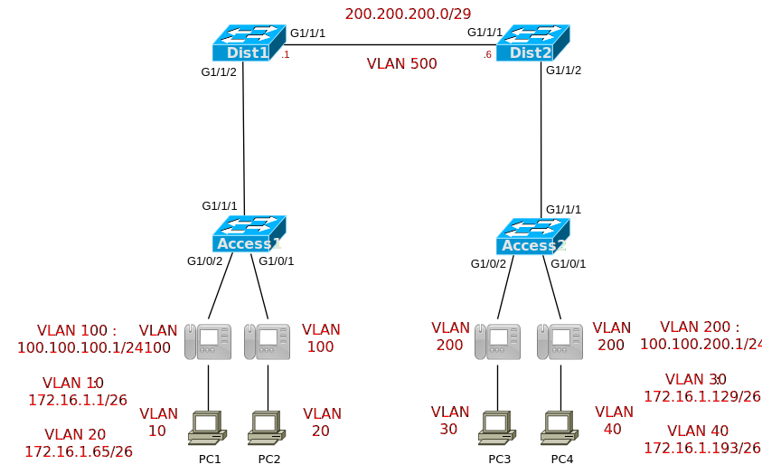

# [clab15](https://www.certskills.com/clab15/)

## Initial Configuration

Examples 1, 2, 3, and 4 show the beginning configuration state of Dist1, Dist2, Access1, and Access2.

    hostname Dist1
    !
    ip routing
    !
    interface GigabitEthernet1/1/1
     no shutdown
    !
    interface GigabitEthernet1/1/2
     no shutdown
    !
    router ospf 1
     network 0.0.0.0 255.255.255.255 area 0

#### Example 1: Dist1 Config

    hostname Dist2
    !
    ip routing
    !
    interface GigabitEthernet1/1/1
     no shutdown
    !
    interface GigabitEthernet1/1/2
     no shutdown
    !
    router ospf 1 
     network 0.0.0.0 255.255.255.255 area 0

#### Example 2: Dist2 Config

    hostname Access1
    !
    interface GigabitEthernet1/0/1
     no shutdown
    !
    interface GigabitEthernet1/0/2
     no shutdow
    !
    interface GigabitEthernet1/1/1
     no shutdown

#### Example 3: Access1 Config

    hostname Access2
    !
    interface GigabitEthernet1/0/1
     no shutdown
    !
    interface GigabitEthernet1/0/2
     no shutdow
    !
    interface GigabitEthernet1/1/1
     no shutdown

#### Example 4: Access2 Config

## Answer Options - Click Tabs to Reveal

- Option 1: Paper/Editor
- Option 2: Cisco Packet Tracer
- Option 3: Cisco Modeling Labs

#### Option 1: Paper/Editor

You can learn a lot and strengthen real learning of the topics by creating the configuration – even without a router or switch CLI. In fact, these labs were originally built to be used solely as a paper exercise!

To answer, just think about the lab. Refer to your primary learning material for CCNA, your notes, and create the configuration on paper or in a text editor. Then check your answer versus the answer post, which is linked at the bottom of the lab, just above the comments section.

#### Option 2: Cisco Packet Tracer

You can also implement the lab using the Cisco Packet Tracer network simulator. With this option, you use Cisco’s free Packet Tracer simulator. You open a file that begins with the initial configuration already loaded. Then you implement your configuration and test to determine if it met the requirements of the lab.

[(Use this link for more information about Cisco Packet Tracer.](https://www.certskills.com/packettracer))

Use this workflow to do the labs in Cisco Packet Tracer:

1. Download the .pkt file linked below.
2. Open the .pkt file, creating a working lab with the same topology and interfaces as the lab exercise.
3. Add your planned configuration to the lab.
4. Test the configuration using some of the suggestions below.

[Download this lab’s Packet Tracer File](https://files.certskills.com/virl/clab152.pkt)

#### Option 3: Cisco Modeling Labs

You can also implement the lab using [Cisco Modeling Labs – Personal (CML-P)](https://developer.cisco.com/modeling-labs/). CML-P (or simply CML) replaced Cisco [Virtual Internet Routing Lab (VIRL)](https://virl.cisco.com/) software in 2020, in effect serving as VIRL Version 2.

If you prefer to use CML, use a similar workflow as you would use if using Cisco Packet Tracer, as follows:

1. Download the CML file (filetype .yaml) linked below.
2. Import the lab’s CML file into CML and then start the lab.
3. Compare the lab topology and interface IDs to this lab, as they may differ (more detail below).
4. Add your planned configuration to the lab.
5. Test the configuration using some of the suggestions below.

[Download this lab’s CML file!](https://files.certskills.com/virl/clab152.yaml)

#### Network Device Info:

This table lists the interfaces listed in the lab exercise documentation versus those used in the sample CML file.

| **Device** | **Lab Port** | **CML Port** |
| --- | --- | --- |
| Dist1 | G1/1/1 | G0/1 |
| Dist1 | G1/1/2 | G0/2 |
| Dist2 | G1/1/1 | G0/1 |
| Dist2 | G1/1/2 | G0/2 |
| Access1 | G1/1/1 | G0/1 |
| Access1 | G1/0/1 | G0/3 |
| Access1 | G1/0/2 | G0/2 |
| Access2 | G1/1/1 | G0/1 |
| Access2 | G1/0/1 | G0/3 |
| Access2 | G1/0/2 | G0/2 |

#### Host device info:

This table lists host information pre-configured in CML, information that might not be required by the lab but may be useful to you.

| **Device** | **IP Address** | **Gateway** | **User/password** |
| --- | --- | --- | --- |
| PC1 | 172.16.1.50 | 172.16.1.1 | cisco/cisco |
| PC2 | 172.16.1.100 | 172.16.1.65 | cisco/cisco |
| PC3 | 172.16.1.150 | 172.16.1.129 | cisco/cisco |
| PC4 | 172.16.1.200 | 172.16.1.193 | cisco/cisco |

# Lab Answers Below: Spoiler Alert

---

## Answers

#### 

#### Figure 1: Topology in Which to Add new IP Phones to Voice VLAN 100

    vlan 10,20,100,500
    !
    interface GigabitEthernet1/1/1
     switchport access vlan 500
    !
    interface GigabitEthernet1/1/2
     switchport trunk encapsulation dot1q
     switchport mode trunk
    !
    interface Vlan10
     ip address 172.16.1.1 255.255.255.192
     no shutdown
    !
    interface Vlan20
     ip address 172.16.1.65 255.255.255.192
     no shutdown
    !
    interface Vlan100
     ip address 100.100.100.1 255.255.255.0
     no shutdown
    !
    interface Vlan500
     ip address 200.200.200.1 255.255.255.248
     no shutdown

#### Example 1: Dist1 Config

    vlan 30,40,200,500
    !
    interface GigabitEthernet1/1/1
     switchport access vlan 500
    !
    interface GigabitEthernet1/1/2
     switchport trunk encapsulation dot1q
     switchport mode trunk
    !
    interface Vlan30
     ip address 172.16.1.129 255.255.255.192
     no shutdown
    !
    interface Vlan40
     ip address 172.16.1.193 255.255.255.192
     no shutdown
    !
    interface Vlan200
     ip address 100.100.200.1 255.255.255.0
     no shutdown
    !
    interface Vlan500
     ip address 200.200.200.6 255.255.255.248
     no shutdown

#### Example 2: Dist2 Config

    vlan 10,20,100
    !
    interface GigabitEthernet1/0/1
     switchport access vlan 20
     switchport voice vlan 100
    !
    interface GigabitEthernet1/0/2
     switchport access vlan 10
     switchport voice vlan 100
    !
    interface GigabitEthernet1/1/1
     switchport trunk encapsulation dot1q
     switchport mode trunk

#### Example 3: Access1 Config

    vlan 30,40,200
    !
    interface GigabitEthernet1/0/1
     switchport access vlan 40
     switchport voice vlan 200
    !
    interface GigabitEthernet1/0/2
     switchport access vlan 30
     switchport voice vlan 200
    !
    interface GigabitEthernet1/1/1
     switchport trunk encapsulation dot1q
     switchport mode trunk

#### Example 4: Access2 Config