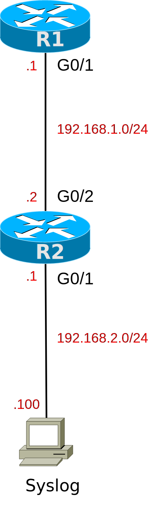

# [clab159](https://www.certskills.com/clab159/)

## Initial Configuration

Examples 1 and 2 show the beginning configuration state of R1 and R2.

    hostname R1
    !
    enable secret cs
    !
    interface GigabitEthernet0/1
     ip address 192.168.1.1 255.255.255.0
     no shutdown
    !
    router ospf 1
     network 0.0.0.0 255.255.255.255 area 0
    !
    line vty 0 4
     password cs
     login
     transport input telnet

#### Example 1: R1 Config

    hostname R2
    !
    enable secret cs
    !
    interface GigabitEthernet0/1
     ip address 192.168.2.1 255.255.255.0
     no shutdown    
    !
    interface GigabitEthernet0/2
     ip address 192.168.1.2 255.255.255.0
     no shutdown
    !
    router ospf 1
     network 0.0.0.0 255.255.255.255 area 0
    !
    line vty 0 4
     password cs
     login
     transport input telnet

#### Example 2: R2 Config

## Answer Options - Click Tabs to Reveal

- Option 1: Paper/Editor
- Option 2: Cisco Packet Tracer
- Option 3: Cisco Modeling Labs

#### Option 1: Paper/Editor

You can learn a lot and strengthen real learning of the topics by creating the configuration – even without a router or switch CLI. In fact, these labs were originally built to be used solely as a paper exercise!

To answer, just think about the lab. Refer to your primary learning material for CCNA, your notes, and create the configuration on paper or in a text editor. Then check your answer versus the answer post, which is linked at the bottom of the lab, just above the comments section.

#### Option 2: Cisco Packet Tracer

Although you can attempt this lab using the Cisco Packet Tracer network simulator, it does not support many of the required commands. Feel free to attempt the lab, just be aware that you may be more productive for this lab by simply noting your configuration on paper or in an editor and checking your answers vs. the answers shown here in the lab.

[(Use this link for more information about Cisco Packet Tracer.](https://www.certskills.com/packettracer))

Use this workflow to do the labs in Cisco Packet Tracer:

1. Download the .pkt file linked below.
2. Open the .pkt file, creating a working lab with the same topology and interfaces as the lab exercise.
3. Add your planned configuration to the lab.
4. Test the configuration using some of the suggestions below.

[Download this lab’s Packet Tracer File](https://files.certskills.com/virl/clab159.pkt)

#### Option 3: Cisco Modeling Labs

You can also implement the lab using [Cisco Modeling Labs – Personal (CML-P)](https://developer.cisco.com/modeling-labs/). CML-P (or simply CML) replaced Cisco [Virtual Internet Routing Lab (VIRL)](https://virl.cisco.com/) software in 2020, in effect serving as VIRL Version 2.

If you prefer to use CML, use a similar workflow as you would use if using Cisco Packet Tracer, as follows:

1. Download the CML file (filetype .yaml) linked below.
2. Import the lab’s CML file into CML and then start the lab.
3. Compare the lab topology and interface IDs to this lab, as they may differ (more detail below).
4. Add your planned configuration to the lab.
5. Test the configuration using some of the suggestions below.

[Download this lab’s CML file!](https://files.certskills.com/virl/clab159.yaml)

#### Network Device Info:

The CML topology matches the lab topology.

# Lab Answers Below: Spoiler Alert

---

## Answers

#### 

#### Figure 1: Two Router Topology

    no logging monitor    ! Requirement 1
    logging console 4     ! Requirement 3
    logging buffered 6    ! Requirement 4

#### Example 1: R1 Config (Global Commands)

    no logging console             ! Requirement 2
    no logging buffered            ! Requirement 2
    logging host 192.168.2.100     ! Requirement 5
    logging monitor notifications  ! Requirement 6

#### Example 2: R2 Config (Global Commands)