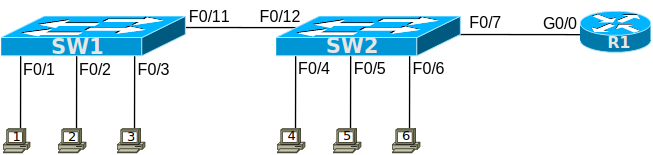

# [clab202](https://www.certskills.com/clab202/)

## Answer Options - Click Tabs to Reveal

- Option 1: Paper/Editor
- Option 2: Cisco Packet Tracer
- Option 3: Cisco Modeling Labs

#### Option 1: Paper/Editor

You can learn a lot and strengthen real learning of the topics by creating the configuration – even without a router or switch CLI. In fact, these labs were originally built to be used solely as a paper exercise!

To answer, just think about the lab. Refer to your primary learning material for CCNA, your notes, and create the configuration on paper or in a text editor. Then check your answer versus the answer post, which is linked at the bottom of the lab, just above the comments section.

#### Option 2: Cisco Packet Tracer

You can also implement the lab using the Cisco Packet Tracer network simulator. With this option, you use Cisco’s free Packet Tracer simulator. You open a file that begins with the initial configuration already loaded. Then you implement your configuration and test to determine if it met the requirements of the lab.

[(Use this link for more information about Cisco Packet Tracer.](https://www.certskills.com/packettracer))

Use this workflow to do the labs in Cisco Packet Tracer:

1. Download the .pkt file linked below.
2. Open the .pkt file, creating a working lab with the same topology and interfaces as the lab exercise.
3. Add your planned configuration to the lab.
4. Test the configuration using some of the suggestions below.

[Download this lab’s Packet Tracer File](https://files.certskills.com/virl/clab202.pkt)

#### Option 3: Cisco Modeling Labs

You can also implement the lab using [Cisco Modeling Labs – Personal (CML-P)](https://developer.cisco.com/modeling-labs/). CML-P (or simply CML) replaced Cisco [Virtual Internet Routing Lab (VIRL)](https://virl.cisco.com/) software in 2020, in effect serving as VIRL Version 2.

If you prefer to use CML, use a similar workflow as you would use if using Cisco Packet Tracer, as follows:

1. Download the CML file (filetype .yaml) linked below.
2. Import the lab’s CML file into CML and then start the lab.
3. Compare the lab topology and interface IDs to this lab, as they may differ (more detail below).
4. Add your planned configuration to the lab.
5. Test the configuration using some of the suggestions below.

[Download this lab’s CML file!](https://files.certskills.com/virl/clab202.yaml)

#### Network Device Info:

This table lists the interfaces listed in the lab exercise documentation versus those used in the sample CML file.

| **Device** | **Lab Port** | **CML Port** |
| --- | --- | --- |
| SW1 | F0/1 | G2/1 |
| SW1 | F0/2 | G2/2 |
| SW1 | F0/3 | G2/3 |
| SW1 | F0/11 | G1/1 |
| SW2 | F0/4 | G3/1 |
| SW2 | F0/5 | G3/2 |
| SW2 | F0/6 | G3/3 |
| SW2 | F0/7 | G0/1 |
| SW2 | F0/12 | G1/2 |

# Lab Answers Below: Spoiler Alert

---

## Answers

The configurations for Problem 1 on both SW1 and SW2 are listed below.

    interface FastEthernet0/1
     switchport mode access
     switchport port-security
     ! everything else happens to be the default
    !
    interface FastEthernet0/2
     switchport mode access
     switchport port-security
     switchport port-security mac-address 0000.0000.2222
     switchport port-security violation protect
     ! All defaults, except the static config of the MAC
     ! address, plus the mode of “protect”.
    !
    interface FastEthernet0/3
     switchport mode access
     switchport port-security
     switchport port-security maximum 2
     switchport port-security violation restrict
     switchport port-security mac-address sticky
     ! Allow dynamic learning of 2 MACs, sticky them,
     ! plus the mode of “restrict”.

#### Example 1: SW1 New Config

    interface FastEthernet0/4
     switchport mode access
     switchport port-security
     switchport port-security maximum 2
     ! everything else happens to be the default
    !
    interface FastEthernet0/5
     switchport mode access
     switchport port-security
     switchport port-security maximum 3
     switchport port-security mac-address 0000.0000.5555
     switchport port-security violation protect
     ! Mostly non-defaults: max of 3, but just 1 statically
     ! configured, with mode of “protect”.
    !
    interface FastEthernet0/6
     switchport mode access
     switchport port-security
     switchport port-security maximum 3
     switchport port-security violation restrict
     switchport port-security mac-address sticky
     ! Allow dynamic learning of 3 MACs, sticky them,
     ! plus the mode of “restrict”.

#### Example 2: SW2 Config