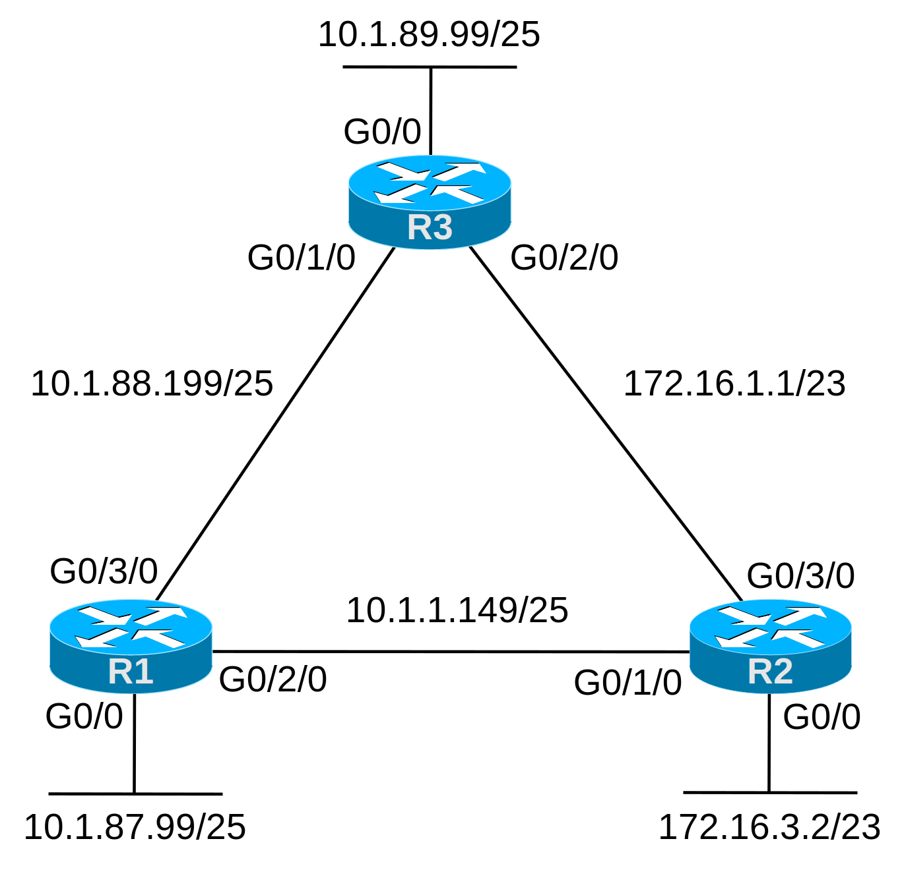

# [clab203](https://www.certskills.com/clab203/)

## Initial Configuration

Assume that the routers have no configuration to begin the lab other than their hostnames.

## Answer Options - Click Tabs to Reveal

- Option 1: Paper/Editor
- Option 2: Cisco Packet Tracer
- Option 3: Cisco Modeling Labs

#### Option 1: Paper/Editor

You can learn a lot and strengthen real learning of the topics by creating the configuration – even without a router or switch CLI. In fact, these labs were originally built to be used solely as a paper exercise!

To answer, just think about the lab. Refer to your primary learning material for CCNA, your notes, and create the configuration on paper or in a text editor. Then check your answer versus the answer post, which is linked at the bottom of the lab, just above the comments section.

#### Option 2: Cisco Packet Tracer

You can also implement the lab using the Cisco Packet Tracer network simulator. With this option, you use Cisco’s free Packet Tracer simulator. You open a file that begins with the initial configuration already loaded. Then you implement your configuration and test to determine if it met the requirements of the lab.

[(Use this link for more information about Cisco Packet Tracer.](https://www.certskills.com/packettracer))

Use this workflow to do the labs in Cisco Packet Tracer:

1. Download the .pkt file linked below.
2. Open the .pkt file, creating a working lab with the same topology and interfaces as the lab exercise.
3. Add your planned configuration to the lab.
4. Test the configuration using some of the suggestions below.

[Download this lab’s Packet Tracer File](https://files.certskills.com/virl/clab203.pkt)

#### Option 3: Cisco Modeling Labs

## This Lab Supports Both CML-Free and CML-Personal!!!

The downloadable file listed here works in both CML-P or CML-F because it uses the IOL (router) and IOL-L2 (switch) reference platform images supported by both products as of CML V2.8. Note that these images also require less CPU and RAM than the other CML-P options.

Use the same general workflow as with Cisco Packet Tracer, as follows:

1. Download the CML file (filetype .yaml) linked below.
2. Import the lab’s CML file into CML.
3. Start the lab in CML.
4. Compare the CML lab topology and interface IDs to this lab Blog page, as they may differ (more detail below).
5. Add your planned configuration to the lab, adjusting for interface ID differences.
6. Test the configuration using some of the suggestions below.

[Download this lab’s CML file!](https://files.certskills.com/virl/clab203-free.yaml)

#### Interface ID Differences:

The lab diagrams on this page use interface IDs (IIDs) that match the Packet Tracer version of the lab. When using CML, adjust the lab IIDs based on this table. Also, note that the IOL and IOL-L2 images used by the supplied CML file support only the “Ethernet” interface type, and not “FastEthernet” or “GigabitEthernet”.

The conventions for **this lab** are:

- All Gigabit interfaces convert to Ethernet interfaces.
- IID G0/0 converts to E0/0.
- IIDs in the pattern G0/x/0 convert to E0/x.  For example, G0/1/0 becomes E0/1.

The following table details all combinations of IID changes for this lab.

| **Lab Port** | **CML Port** |
| --- | --- |
| G**0/0** | E**0/0** |
| G**0/1**/0 | E**0/1** |
| G**0/2**/0 | E**0/2** |
| G**0/3**/0 | E**0/3** |

# Lab Answers Below: Spoiler Alert

---

## Answers

To find the lowest IP addresses, calculate the subnet ID, and then add 1 in the 4^th^ octet. I won’t go into how to find the subnet ID – that’s all over the books – but I’ll entertain specific questions if you have them. Then you just need to configure the IP addresses using the **ip address** *address mask* interface subcommand, as shown here.

#### Figure 1: Three Router Topology w/ Sample IP Addresses for Calculations

    interface GigabitEthernet0/0
     no shutdown
     ip address 10.1.87.1 255.255.255.128
    !
    interface GigabitEthernet0/2/0
     no shutdown
     ip address 10.1.1.129 255.255.255.128
    !
    interface GigabitEthernet0/3/0
     no shutdown
     ip address 10.1.88.129 255.255.255.128

#### Example 1: R1 Config

    interface GigabitEthernet0/0
     no shutdown
     ip address 172.16.2.1 255.255.254.0
    !
    interface GigabitEthernet0/1/0
     no shutdown
     ip address 10.1.1.130 255.255.255.128
    !
    interface GigabitEthernet0/3/0
     no shutdown
     ip address 172.16.0.1 255.255.254.0

#### Example 2: R2 Config

    interface GigabitEthernet0/0
     no shutdown
     ip address 10.1.89.1 255.255.255.128
    !
    interface GigabitEthernet0/1/0
     no shutdown
     ip address 10.1.88.130 255.255.255.128
    !
    interface GigabitEthernet0/2/0
     no shutdown
     ip address 172.16.0.2 255.255.254.0

#### Example 3: R3 Config