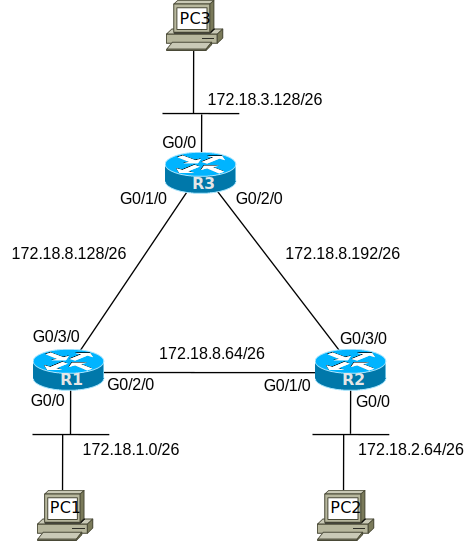

# [clab205](https://www.certskills.com/clab205/)

## Answer Options - Click Tabs to Reveal

- Option 1: Paper/Editor
- Option 2: Cisco Packet Tracer
- Option 3: Cisco Modeling Labs

#### Option 1: Paper/Editor

You can learn a lot and strengthen real learning of the topics by creating the configuration – even without a router or switch CLI. In fact, these labs were originally built to be used solely as a paper exercise!

To answer, just think about the lab. Refer to your primary learning material for CCNA, your notes, and create the configuration on paper or in a text editor. Then check your answer versus the answer post, which is linked at the bottom of the lab, just above the comments section.

#### Option 2: Cisco Packet Tracer

You can also implement the lab using the Cisco Packet Tracer network simulator. With this option, you use Cisco’s free Packet Tracer simulator. You open a file that begins with the initial configuration already loaded. Then you implement your configuration and test to determine if it met the requirements of the lab.

[(Use this link for more information about Cisco Packet Tracer.](https://www.certskills.com/packettracer))

Use this workflow to do the labs in Cisco Packet Tracer:

1. Download the .pkt file linked below.
2. Open the .pkt file, creating a working lab with the same topology and interfaces as the lab exercise.
3. Add your planned configuration to the lab.
4. Test the configuration using some of the suggestions below.

[Download this lab’s Packet Tracer File](https://files.certskills.com/virl/clab205.pkt)

#### Option 3: Cisco Modeling Labs

## This Lab Supports Both CML-Free and CML-Personal!!!

The downloadable file listed here works in both CML-P or CML-F because it uses the IOL (router) and IOL-L2 (switch) reference platform images supported by both products as of CML V2.8. Note that these images also require less CPU and RAM than the other CML-P options.

Use the same general workflow as with Cisco Packet Tracer, as follows:

1. Download the CML file (filetype .yaml) linked below.
2. Import the lab’s CML file into CML.
3. Start the lab in CML.
4. Compare the CML lab topology and interface IDs to this lab Blog page, as they may differ (more detail below).
5. Add your planned configuration to the lab, adjusting for interface ID differences.
6. Test the configuration using some of the suggestions below.

[Download this lab’s CML file!](https://files.certskills.com/virl/clab205-free.yaml)

#### Interface ID Differences:

Any lab diagrams shown with this lab use interface IDs per the conventions of the Packet Tracer version of the lab. When using CML, adjust the lab interfaces used based on this table. Also, note that the IOL and IOL-L2 images use interface type “Ethernet”, not “FastEthernet” or “GigabitEthernet”.

| **DeviceType** | **Lab Port** | **CML Port** |
| --- | --- | --- |
| Router | G**0/0** | E**0/0** |
| Router | G**0/1**/0 | E**0/1** |
| Router | G**0/2**/0 | E**0/2** |
| Router | G**0/3**/0 | E**0/3** |

# Lab Answers Below: Spoiler Alert

---

## Answers

Your first task was to calculate the IP addresses to use, based on requirements. For reference, Table 1 lists the results. Note that all subnets use a /26 (255.255.255.192) mask in this particular exercise.

| **Location** | **IP/mask** |
| --- | --- |
| R1 G0/0 | 172.18.1.62 /26 |
| R1 G0/2/0 | 172.18.8.125 /26 |
| R1 G0/3/0 | 172.18.8.189 /26 |
| R2 G0/0 | 172.18.2.126 /26 |
| R2 G0/1/0 | 172.18.8.126 /26 |
| R2 G0/3/0 | 172.18.8.253 /26 |
| R3 G0/0 | 172.18.3.190 /26 |
| R3 G0/1/0 | 172.18.8.190 /26 |
| R3 G0/2/0 | 172.18.8.254 /26 |

#### Table 1: IPv4 Addresses

To create the configuration, all you have to do is add the **ip address** command to each interface in configuration mode. Easy once you’d done it a few times; here are the answers to be complete.

    interface GigabitEthernet0/0
     ip address 172.18.1.62 255.255.255.192
    !
    interface GigabitEthernet0/2/0
     ip address 172.18.8.125 255.255.255.192
    !
    interface GigabitEthernet0/3/0
     ip address 172.18.8.189 255.255.255.192

#### Example 1: R1 IPv4 Address Configuration

    interface GigabitEthernet0/0
     ip address 172.18.2.126 255.255.255.192
    !
    interface GigabitEthernet0/1/0
     ip address 172.18.8.126 255.255.255.192
    !
    interface GigabitEthernet0/3/0
     ip address 172.18.8.253 255.255.255.192

#### Example 2: R2 IPv4 Address Configuration

    interface GigabitEthernet0/0
     ip address 172.18.3.190 255.255.255.192
    !
    interface GigabitEthernet0/1/0
     ip address 172.18.8.190 255.255.255.192
    !
    interface GigabitEthernet0/2/0
     ip address 172.18.8.254 255.255.255.192

#### Example 3: R3 IPv4 Address Configuration