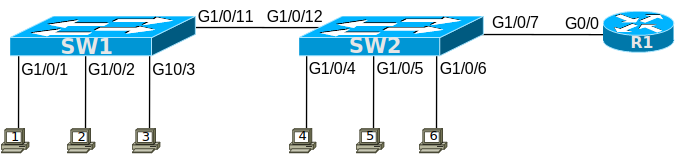

# [clab208](https://www.certskills.com/clab208/)

## Lab Requirements

This lab uses the simple LAN shown in Figure 1. It shows two switches connected by a link, with a router on the side.

**Figure 1 – Lab Topology**

For this lab, you should configure the IP settings for the two LAN switches. You need to decide what IP settings need to be configured and then plan the specific configuration commands. The list of requirements includes the subnet ID to use. Specifically:

1. Both switches use VLAN 1 as the management VLAN.
2. Use subnet 192.168.1.0/27.
3. Use the numerically highest IP addresses: the highest for the router’s G0/0 interface into the LAN, the next highest for SW1’s management address, and the next highest for SW2’s management address. Note that R1’s IP address has been pre-configured for the purposes of this lab.
4. Configure SW1 and SW2 to allow communication off-subnet as well as on-subnet.
5. Neither switch uses VLAN trunking, and all ports are in the default VLAN (1).

## Initial Configuration

You can do this lab with the assumption that neither switch has any initial configuration. However, to make the lab more interesting, instead assume the following initial configuration. The configuration on the two switches includes the commands which, once you add the correct IP configuration, allow Telnet (both switches) and SSH (SW2 only) into the switches. The router R1 configuration includes a minimal configuration to act as the default gateway in the subnet.

    hostname SW1
    !
    enable password sw1bad
    !
    interface GigabitEthernet1/0/1  
     description connected to PC1 
    ! 
    interface GigabitEthernet1/0/2
     description connected to PC2
    ! 
    interface GigabitEthernet1/0/3  
     description connected to PC3 
    ! 
    interface GigabitEthernet1/0/11 
     description connected to SW2 
    ! 
    line con 0 
     login 
     password fred 
    line vty 0 15 
     login 
     password sw1 
     transport input telnet

#### Example 1: SW1 Config

    hostname SW2
    !
    ip domain-name example.com
    crypto key generate rsa modulus 768
    username fred password barney
    !
    enable secret sw2good
    !
    interface GigabitEthernet1/0/4
     description connected to PC4
    !
    interface GigabitEthernet1/0/5
     description connected to PC5
    !
    interface GigabitEthernet1/0/6
     description connected to PC6
    !
    interface GigabitEthernet1/0/12
     description connected to SW1
    ! 
    interface GigabitEthernet1/0/7
     description connected to R1
    !
    line con 0
     login
     password fred
    !
    line vty 0 15
     login local
     transport input all

#### Example 2: SW2 Config

    hostname R1
    !
    interface GigabitEthernet0/0
     ip address 192.168.1.30 255.255.255.224

#### Example 3: R1 Config

### Config Lab Intro Video

<iframe id="iframe-player-10" data-id="10" title="Switch IP Config: Config Lab Intro" width="1140" height="641" src="https://www.youtube.com/embed/zmy8jiktNOw?feature=oembed" frameborder="0" allow="accelerometer; autoplay; clipboard-write; encrypted-media; gyroscope; picture-in-picture; web-share" referrerpolicy="strict-origin-when-cross-origin" allowfullscreen></iframe>

The above lab intro – the text, figures, and initial configuration – tells you all you need to know. But if you want a little more, with a little different slant on what to do in this lab, watch this lab intro video!

## Answer Options - Click Tabs to Reveal

- Option 1: Paper/Editor
- Option 2: Cisco Packet Tracer
- Option 3: Cisco Modeling Labs

#### Option 1: Paper/Editor

You can learn a lot and strengthen real learning of the topics by creating the configuration – even without a router or switch CLI. In fact, these labs were originally built to be used solely as a paper exercise!

To answer, just think about the lab. Refer to your primary learning material for CCNA, your notes, and create the configuration on paper or in a text editor. Then check your answer versus the answer post, which is linked at the bottom of the lab, just above the comments section.

#### Option 2: Cisco Packet Tracer

You can also implement the lab using the Cisco Packet Tracer network simulator. With this option, you use Cisco’s free Packet Tracer simulator. You open a file that begins with the initial configuration already loaded. Then you implement your configuration and test to determine if it met the requirements of the lab.

[(Use this link for more information about Cisco Packet Tracer.](https://www.certskills.com/packettracer))

Use this workflow to do the labs in Cisco Packet Tracer:

1. Download the .pkt file linked below.
2. Open the .pkt file, creating a working lab with the same topology and interfaces as the lab exercise.
3. Add your planned configuration to the lab.
4. Test the configuration using some of the suggestions below.

[Download this lab’s Packet Tracer File](https://files.certskills.com/virl/clab208.pkt)

#### Option 3: Cisco Modeling Labs

You can also implement the lab using [Cisco Modeling Labs – Personal (CML-P)](https://developer.cisco.com/modeling-labs/). CML-P (or simply CML) replaced Cisco [Virtual Internet Routing Lab (VIRL)](https://virl.cisco.com/) software in 2020, in effect serving as VIRL Version 2.

If you prefer to use CML, use a similar workflow as you would use if using Cisco Packet Tracer, as follows:

1. Download the CML file (filetype .yaml) linked below.
2. Import the lab’s CML file into CML and then start the lab.
3. Compare the lab topology and interface IDs to this lab, as they may differ (more detail below).
4. Add your planned configuration to the lab.
5. Test the configuration using some of the suggestions below.

[Download this lab’s CML file!](https://files.certskills.com/virl/clab208.yaml)

#### Network Device Info:

This table lists the interfaces listed in the lab exercise documentation versus those used in the sample CML file.

| **Device** | **Lab Port** | **CML Port** |
| --- | --- | --- |
| SW1 | G1/0/1 | G2/1 |
| SW1 | G1/0/2 | G2/2 |
| SW1 | G1/0/3 | G2/3 |
| SW1 | G1/0/11 | G1/1 |
| SW2 | G1/0/4 | G3/1 |
| SW2 | G1/0/5 | G3/2 |
| SW2 | G1/0/6 | G3/3 |
| SW2 | G1/0/7 | G0/1 |
| SW2 | G1/0/12 | G1/2 |

# Lab Answers Below: Spoiler Alert