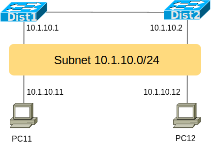
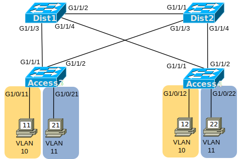
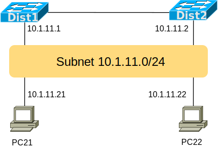

# [clab301](https://www.certskills.com/clab301/)

## Lab Requirements

This lab begins with a working network. It shows two PCs, each in two separate VLANs/Subnets. To start the lab, PCs in the same subnet/VLAN can ping each other. However, PCs in different subnets cannot ping each other to begin the lab. Therefore, you need to configure layer 3 switching on the two distribution switches to route packets between the subnets.

Once you understand the initial configuration, configure distribution switches Dist1 and Dist2 with SVIs – VLAN interfaces – for VLAN 10 and VLAN 11. Use the following details:

1. For VLAN 10, create and configure a VLAN 10 interface:
    1. For Dist1, use address/mask 10.1.10.1/24.
    2. For Dist2, use address/mask 10.1.10.2/24.
2. For VLAN 11, create and configure a VLAN 11 interface:
    1. For Dist1, use address/mask 10.1.11.1/24.
    2. For Dist2, use address/mask 10.1.11.2/24.

#### Figure 1: Topology for this Lab

#### Figure 2: Layer 3 Topology – Subnet 10

#### Figure 3: Layer 3 Topology – Subnet 11

## Initial Configuration

The four switches begin with VLAN, VLAN trunking, and STP configuration to support the two VLANs used in this lab (VLANs 10 and 11.) The STP config causes switch Dist1 to be the root switch for VLAN 10 and Dist2 to be the root switch for VLAN 11. All switch-to-switch links act as VLAN trunks. For information about the PCs and the router, look below these next four examples.

    hostname Dist1
    !
    vtp mode transparent
    vlan 10,11
    !
    spanning-tree vlan 10 root primary
    spanning-tree vlan 11 root secondary
    !
    interface range GigabitEthernet1/1/1-4
     switchport mode trunk

#### Example 1: Dist1 Config

    hostname Dist2
    !
    vtp mode transparent
    vlan 10,11
    !
    spanning-tree vlan 11 root primary
    spanning-tree vlan 10 root secondary
    !
    interface range GigabitEthernet1/1/1-4
     switchport mode trunk

#### Example 2: Dist2 Config

    hostname Access3
    !
    vtp mode transparent
    vlan 10,11
    !
    interface range GigabitEthernet1/1/1-2
     switchport mode trunk
    !
    interface GigabitEthernet1/0/11
     switchport mode access
     switchport access vlan 10
    !
    interface GigabitEthernet1/0/21
     switchport mode access
     switchport access vlan 11

#### Example 3: Access3 Config

    hostname Access4
    !
    vtp mode transparent
    vlan 10,11
    !
    interface range GigabitEthernet1/1/1-2
     switchport mode trunk
    !
    interface GigabitEthernet1/0/12
     switchport mode access
     switchport access vlan 10
    !
    interface GigabitEthernet1/0/22
     switchport mode access
     switchport access vlan 11

#### Example 4: Access4 Config

The four PCs connect to two different access VLANs and subnets, as follows:

- PC11 and PC12: VLAN 10, subnet 10.1.10.0/24, gateway 10.1.10.1.
- PC21 and PC22: VLAN 11, subnet 10.1.11.0/24, gateway 10.1.11.2.

    Address: 10.1.10.11
    Mask: 255.255.255.0
    Gateway: 10.1.10.1

#### Example 5: PC11 Configuration Settings

    Address: 10.1.10.12
    Mask: 255.255.255.0
    Gateway: 10.1.10.1

#### Example 6: PC12 Configuration Settings

    Address: 10.1.11.21
    Mask: 255.255.255.0
    Gateway: 10.1.11.2

#### Example 7: PC21 Configuration Settings

    Address: 10.1.11.22
    Mask: 255.255.255.0
    Gateway: 10.1.11.2

#### Example 8: PC22 Configuration Settings

## Answer Options - Click Tabs to Reveal

- Option 1: Paper/Editor
- Option 2: Cisco Packet Tracer
- Option 3: Cisco Modeling Labs

#### Option 1: Paper/Editor

You can learn a lot and strengthen real learning of the topics by creating the configuration – even without a router or switch CLI. In fact, these labs were originally built to be used solely as a paper exercise!

To answer, just think about the lab. Refer to your primary learning material for CCNA, your notes, and create the configuration on paper or in a text editor. Then check your answer versus the answer post, which is linked at the bottom of the lab, just above the comments section.

#### Option 2: Cisco Packet Tracer

You can also implement the lab using the Cisco Packet Tracer network simulator. With this option, you use Cisco’s free Packet Tracer simulator. You open a file that begins with the initial configuration already loaded. Then you implement your configuration and test to determine if it met the requirements of the lab.

[(Use this link for more information about Cisco Packet Tracer.](https://www.certskills.com/packettracer))

Use this workflow to do the labs in Cisco Packet Tracer:

1. Download the .pkt file linked below.
2. Open the .pkt file, creating a working lab with the same topology and interfaces as the lab exercise.
3. Add your planned configuration to the lab.
4. Test the configuration using some of the suggestions below.

[Download this lab’s Packet Tracer File](https://files.certskills.com/virl/clab301.pkt)

#### Option 3: Cisco Modeling Labs

You can also implement the lab using [Cisco Modeling Labs – Personal (CML-P)](https://developer.cisco.com/modeling-labs/). CML-P (or simply CML) replaced Cisco [Virtual Internet Routing Lab (VIRL)](https://virl.cisco.com/) software in 2020, in effect serving as VIRL Version 2.

If you prefer to use CML, use a similar workflow as you would use if using Cisco Packet Tracer, as follows:

1. Download the CML file (filetype .yaml) linked below.
2. Import the lab’s CML file into CML and then start the lab.
3. Compare the lab topology and interface IDs to this lab, as they may differ (more detail below).
4. Add your planned configuration to the lab.
5. Test the configuration using some of the suggestions below.

[Download this lab’s CML file!](https://files.certskills.com/virl/clab301.yaml)

#### Network Device Info:

This table lists the interfaces used in the lab exercise documentation that differ from those used in the sample CML file.

| **Device** | **Lab Port** | **CML Port** |
| --- | --- | --- |
| Dist1 | G1/1/2 | G1/2 |
| Dist1 | G1/1/3 | G1/3 |
| Dist1 | G1/1/4 | G1/0 |
| Dist2 | G1/1/1 | G1/1 |
| Dist2 | G1/1/3 | G1/3 |
| Dist2 | G1/1/4 | G1/0 |
| Access3 | G1/1/1 | G1/1 |
| Access3 | G1/1/2 | G1/2 |
| Access3 | G1/0/11 | G0/1 |
| Access3 | G1/0/21 | G0/2 |
| Access4 | G1/1/1 | G1/1 |
| Access4 | G1/1/2 | G1/2 |
| Access4 | G1/0/12 | G0/1 |
| Access4 | G1/0/22 | G0/2 |

# Lab Answers Below: Spoiler Alert

---

## Lab Answers

#### Figure 1: Topology for this Lab

    ip routing
    
    interface vlan 10
     ip address 10.1.10.1 255.255.255.0
    !
    interface vlan 11
     ip address 10.1.11.1 255.255.255.0

#### Example: Dist1 Config

    ip routing
    !
    interface vlan 10
     ip address 10.1.10.2 255.255.255.0
    !
    interface vlan 11
     ip address 10.1.11.2 255.255.255.0

#### Example: Dist2 Config