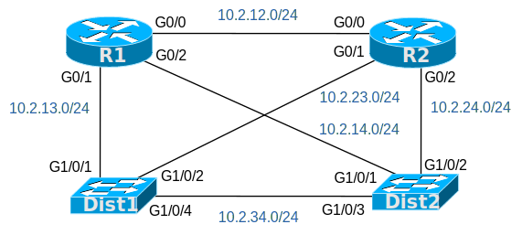
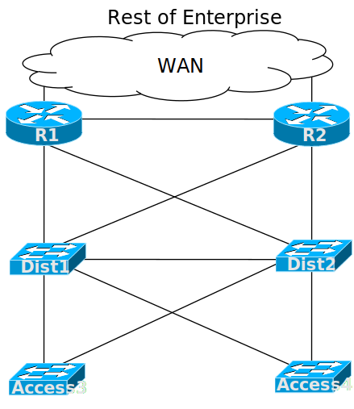

# [clab302](https://www.certskills.com/clab302/)

## Lab Requirements

This lab focuses on four devices, but you need to understand the broader context as well.

First, consider two routers that connect to various WAN links. Those routers connect the site to the WAN so that devices in the local site can communicate with hosts in other sites inside the Enterprise.

#### Figure 1: Context for this Lab

The LAN also uses a traditional distribution/access 2-tier design, as seen at the bottom of Figure 1. The access switches act as layer 2 switches, while the distribution switches act as layer 3 switches.

Focusing on the two routers (R1 and R2) and the two distribution switches (Dist1 and Dist2), the devices each use configuration and behave like routers on the links between them. Routers route the packets received on their interfaces just because of the nature of routers. Layer 3 switches do not switch LAN frames received on an interface, as layer 2 switches do, but instead route packets received on an interface, just like a router.

For this lab, focus on four devices, as shown in Figure 2. Consider routers R1 and R2 to be pre-configured to route IP packets and learn routes with OSPF. You need to configure switches Dist1 and Dist2 to route IP packets, using the links shown in Figure 2 as routed ports and using the IP address/mask combinations as shown.

#### Figure 2: Specific Devices for this Lab

Once you understand the initial configuration, configure distribution switches Dist1 and Dist2 to make the ports shown in Figure 2 operate as routed ports.  Use the following details:

1. Enable IP routing on both Dist1 and Dist2.
2. For the Dist1 and Dist2 ports per Figure 2, configure the ports as routed ports instead of as switched ports. Do NOT use Switched Virtual Interfaces (SVIs). That is, do NOT use VLAN interfaces.
3. On those same ports, configure an IP address/mask as follows:
    1. Use the subnets shown in Figure 2.
    2. For the fourth octet on Dist1, use .3.
    3. For the fourth octet on Dist2, use .4.
4. Enable OSPF on both Dist1 and Dist2 with these commands, supplied so that this lab can focus on the routed interface details:
    1. **router ospf 1**
    2. **network 10.2.0.0 0.0.255.255 area 0**

## Initial Configuration

Layer 3 switches require the configuration of several IP-related features before they can route packets. None of those features come pre-configured for this lab. However, do the lab as if routers R1 and R2 have been pre-configured for all IP routing features per the design details listed in this lab. Layer 3 switches Dist1 and Dist2 should now exchange routes with R1 and R2 and be able to ping all the addresses on routers R1 and R2, and so on. To that end, the configuration on both routers already have:

- IP routing enabled (a default setting on all routers)
- OSPF enabled (assuming the use of the addressing plan for this lab)
- Interface IP addresses configured (per the addressing plan for this lab)

    hostname R1
    !
    interface GigabitEthernet0/0
     ip address 10.2.12.1 255.255.255.0
    !
    interface GigabitEthernet0/1
     ip address 10.2.13.1 255.255.255.0
    !
    interface GigabitEthernet0/2
     ip address 10.2.14.1 255.255.255.0
    !
    router ospf 1
     network 10.2.0.0 0.0.255.255 area 0

#### Example 1: R1 Config

    hostname R2
    !
    interface GigabitEthernet0/0
     ip address 10.2.12.2 255.255.255.0
    !
    interface GigabitEthernet0/1
     ip address 10.2.23.2 255.255.255.0
    !
    interface GigabitEthernet0/2
     ip address 10.2.24.2 255.255.255.0
    !
    router ospf 1
     network 10.2.0.0 0.0.255.255 area 0

#### Example 2: R2 Config

## Answer Options - Click Tabs to Reveal

- Option 1: Paper/Editor
- Option 2: Cisco Packet Tracer
- Option 3: Cisco Modeling Labs

#### Option 1: Paper/Editor

You can learn a lot and strengthen real learning of the topics by creating the configuration – even without a router or switch CLI. In fact, these labs were originally built to be used solely as a paper exercise!

To answer, just think about the lab. Refer to your primary learning material for CCNA, your notes, and create the configuration on paper or in a text editor. Then check your answer versus the answer post, which is linked at the bottom of the lab, just above the comments section.

#### Option 2: Cisco Packet Tracer

You can also implement the lab using the Cisco Packet Tracer network simulator. With this option, you use Cisco’s free Packet Tracer simulator. You open a file that begins with the initial configuration already loaded. Then you implement your configuration and test to determine if it met the requirements of the lab.

[(Use this link for more information about Cisco Packet Tracer.](https://www.certskills.com/packettracer))

Use this workflow to do the labs in Cisco Packet Tracer:

1. Download the .pkt file linked below.
2. Open the .pkt file, creating a working lab with the same topology and interfaces as the lab exercise.
3. Add your planned configuration to the lab.
4. Test the configuration using some of the suggestions below.

[Download this lab’s Packet Tracer File](https://files.certskills.com/virl/clab302.pkt)

#### Option 3: Cisco Modeling Labs

## This Lab Supports Both CML-Free and CML-Personal!!!

The downloadable file listed here works in both CML-P or CML-F because it uses the IOL (router) and IOL-L2 (switch) reference platform images supported by both products as of CML V2.8. Note that these images also require less CPU and RAM than the other CML-P options.

Use the same general workflow as with Cisco Packet Tracer, as follows:

1. Download the CML file (filetype .yaml) linked below.
2. Import the lab’s CML file into CML.
3. Start the lab in CML.
4. Compare the CML lab topology and interface IDs to this lab Blog page, as they may differ (more detail below).
5. Add your planned configuration to the lab, adjusting for interface ID differences.
6. Test the configuration using some of the suggestions below.

[Download this lab’s CML file!](https://files.certskills.com/virl/clab302-free.yaml)

#### Interface ID Differences:

The lab diagrams on this page use interface IDs (IIDs) that match the Packet Tracer version of the lab. When using CML, adjust the lab IIDs based on this table. Also, note that the IOL and IOL-L2 images used by the supplied CML file support only the “Ethernet” interface type, and not “FastEthernet” or “GigabitEthernet”.

The conventions for this lab are:

- Gigabit IIDs convert to an Ethernet interface type. Patterns like G0/x convert to E0/x (for example, G0/0 becomes E0/0)
- Gigabit IIDs convert to an Ethernet interface type. Patterns like G0/x/0 convert to E1/x (for example, G0/1/0 becomes E1/1.)

| **Lab Port** | **CML Port** |
| --- | --- |
| G0/0 | E0/0 |
| G0/1 | E0/1 |
| G0/0/0 | E1/0 |
| G0/1/0 | E1/1 |
| G0/2/0 | E1/2 |

# Lab Answers Below: Spoiler Alert

---

## Lab Answers

#### Figure 1: Layer 3 Topology for this Lab

    ip routing
    !
    interface GigabitEthernet1/0/1
     no switchport
     ip address 10.2.13.3 255.255.255.0
    !
    interface GigabitEthernet1/0/2
     no switchport
     ip address 10.2.23.3 255.255.255.0
    !
    interface GigabitEthernet1/0/4
     no switchport
     ip address 10.2.34.3 255.255.255.0
    !
    router ospf 1
     network 10.2.0.0 0.0.255.255 area 0

#### Example 1: Dist1 Config

    ip routing
    !
    interface GigabitEthernet1/0/1
     no switchport
     ip address 10.2.14.4 255.255.255.0
    !
    interface GigabitEthernet1/0/2
     no switchport
     ip address 10.2.24.4 255.255.255.0
    !
    interface GigabitEthernet1/0/3
     no switchport
     ip address 10.2.34.4 255.255.255.0
    !
    router ospf 1
     network 10.2.0.0 0.0.255.255 area 0

#### Example 2: Dist2 Config