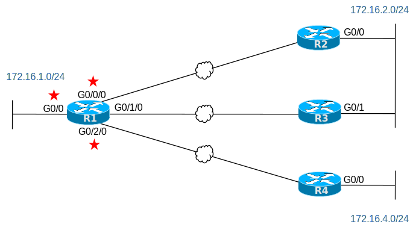

# [clab311](https://www.certskills.com/clab311/)

## Lab Requirements

By default, OSPF routers elect a Designated Router (DR) and Backup Designated Router (BDR) on Ethernet links, whether LAN or WAN. The routers do so because of the OSPF network type of “broadcast,” the default OSPF network type in Cisco IOS for Ethernet interfaces.

When holding an election to choose the DR, the router with the highest OSPF priority – another OSPF interface setting – wins. By default, Cisco IOS sets all interfaces to OSPF priority 1, causing a tie when using defaults. Because the priority values tie, the routers elect the DR based on the best/highest Router ID (RID).

For this lab, configure the OSPF priority values per the following requirements:

1. Before configuring, examine the initial configurations. Predict which routers become the DR and BDR on each Ethernet link that has multiple routers connected to it. In concept, complete the empty column of Table 1.
2. Configure the OSPF interface priority so that:
    1. Router R1 becomes the DR in all cases.
    2. On the R2/R3 LAN, make router R3 become the DR.
    3. Even if a router would become the DR based on a better RID, still configure the OSPF priority so that all the above DR choices flow from the priority settings.
    4. Use the smallest priority value(s) that meet the requirements.
3. Because the configuration of the OSPF priority does not cause a new DR election, note any commands you would need to use to force a recent DR election.

| Link | Predicted DR per Initial Config | Intended DR per this Lab’s Config |
| --- | --- | --- |
| R1-R2 WAN |  | R1 |
| R1-R3 WAN |  | R1 |
| R1-R4 WAN |  | R1 |
| R2-R3 LAN |  | R3 |

#### Table 1: Designated Routers (DRs) in Lab

#### Figure 1: Topology for this Lab

## Initial Configuration

The configurations on the four routers show a minimal OSPF configuration. It uses mostly default OSPF settings, except that the configuration sets the RID for each router.

    hostname R1
    !
    interface GigabitEthernet0/0
     ip address 172.16.1.1 255.255.255.0
     ip ospf 1 area 0
    !
    interface GigabitEthernet0/0/0
     ip address 172.16.12.1 255.255.255.0
     ip ospf 1 area 0
    !
    interface GigabitEthernet0/1/0
     ip address 172.16.13.1 255.255.255.0
     ip ospf 1 area 0
    !
    interface GigabitEthernet0/2/0
     ip address 172.16.14.1 255.255.255.0
     ip ospf 1 area 0
    !
    router ospf 1
     router-id 1.1.1.1

#### Example 1: R1 Config

    hostname R2
    !
    interface GigabitEthernet0/0
     ip address 172.16.2.2 255.255.255.0
     ip ospf 1 area 0
    !
    interface GigabitEthernet0/0/0
     ip address 172.16.12.2 255.255.255.0
     ip ospf 1 area 0
    !
    router ospf 1
     router-id 2.2.2.2

#### Example 2: R2 Config

    hostname R3
    !
    interface GigabitEthernet0/1
     ip address 172.16.2.3 255.255.255.0
     ip ospf 1 area 0
    !
    interface GigabitEthernet0/0/0
     ip address 172.16.13.3 255.255.255.0
     ip ospf 1 area 0
    !
    router ospf 1
     router-id 3.3.3.3

#### Example 3: R3 Config

    hostname R4
    !
    interface GigabitEthernet0/0
     ip address 172.16.4.4 255.255.255.0
     ip ospf 1 area 0
    !
    interface GigabitEthernet0/0/0
     ip address 172.16.14.4 255.255.255.0
     ip ospf 1 area 0
    !
    router ospf 1
     router-id 4.4.4.4

#### Example 4: R4 Config

The lab does not call for any switches or PCs. Note that if you add them yourself, you can use all default configuration in a Cisco switch for this lab, which would place all devices connected to a switch in the same VLAN.

## Answer Options - Click Tabs to Reveal

- Option 1: Paper/Editor
- Option 2: Cisco Packet Tracer
- Option 3: Cisco Modeling Labs

#### Option 1: Paper/Editor

You can learn a lot and strengthen real learning of the topics by creating the configuration – even without a router or switch CLI. In fact, these labs were originally built to be used solely as a paper exercise!

To answer, just think about the lab. Refer to your primary learning material for CCNA, your notes, and create the configuration on paper or in a text editor. Then check your answer versus the answer post, which is linked at the bottom of the lab, just above the comments section.

#### Option 2: Cisco Packet Tracer

You can also implement the lab using the Cisco Packet Tracer network simulator. With this option, you use Cisco’s free Packet Tracer simulator. You open a file that begins with the initial configuration already loaded. Then you implement your configuration and test to determine if it met the requirements of the lab.

[(Use this link for more information about Cisco Packet Tracer.](https://www.certskills.com/packettracer))

Use this workflow to do the labs in Cisco Packet Tracer:

1. Download the .pkt file linked below.
2. Open the .pkt file, creating a working lab with the same topology and interfaces as the lab exercise.
3. Add your planned configuration to the lab.
4. Test the configuration using some of the suggestions below.

[Download this lab’s Packet Tracer File](https://files.certskills.com/virl/clab311.pkt)

#### Option 3: Cisco Modeling Labs

## This Lab Supports Both CML-Free and CML-Personal!!!

The downloadable file listed here works in both CML-P or CML-F because it uses the IOL (router) and IOL-L2 (switch) reference platform images supported by both products as of CML V2.8. Note that these images also require less CPU and RAM than the other CML-P options.

Use the same general workflow as with Cisco Packet Tracer, as follows:

1. Download the CML file (filetype .yaml) linked below.
2. Import the lab’s CML file into CML.
3. Start the lab in CML.
4. Compare the CML lab topology and interface IDs to this lab Blog page, as they may differ (more detail below).
5. Add your planned configuration to the lab, adjusting for interface ID differences.
6. Test the configuration using some of the suggestions below.

[Download this lab’s CML file!](https://files.certskills.com/virl/clab314-free.yaml)

#### Interface ID Differences:

The lab diagrams on this page use interface IDs (IIDs) that match the Packet Tracer version of the lab. When using CML, adjust the lab IIDs based on this table. Also, note that the IOL and IOL-L2 images used by the supplied CML file support only the “Ethernet” interface type, and not “FastEthernet” or “GigabitEthernet”.

The conventions for this lab are:

- Gigabit IIDs with two numbers (G0/0) convert to an Ethernet type with the same numbers, respectively. (For example, G0/0 becomes E0/0, G0/1 becomes E0/1.)
- Gigabit IIDs with a pattern of G0/x/0 convert Ethernet type, with two numbers, in the pattern “E1/x”, where x is the original middle digit. (For example, G0/1/0 becomes E1/1.)

| **Lab Port** | **CML Port** |
| --- | --- |
| G0/0 | E0/0 |
| G0/1 | E0/1 |
| G0/**0**/0 | E1/**0** |
| G0/**1**/0 | E1/**1** |
| G0/**2**/0 | E1/**2** |

# Lab Answers Below: Spoiler Alert

---

## Lab Answers

#### Figure 1: Topology for this Lab

    interface GigabitEthernet0/0/0
     ip ospf priority 2
    !
    interface GigabitEthernet0/1/0
     ip ospf priority 2
    !
    interface GigabitEthernet0/2/0
     ip ospf priority 2

#### Example 1: R1 Config

    interface GigabitEthernet0/1
     ip ospf priority 2

#### Example 2: R3 Config