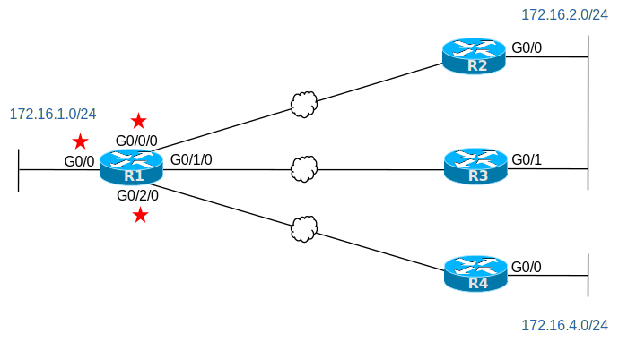

# [clab314](https://www.certskills.com/clab314/)

## Lab Requirements

OSPF uses the concept of cost as its metric for routes. The fundamental concept is straightforward:

1. From one router, consider one remote subnet.
2. Determine all possible routes from that router to the chosen subnet.
3. For each possible route:
    1. Find the OSPF interface cost of each outgoing interface in the route, that is, all interfaces out which a packet would be forwarded when traveling that route.
    2. Add the costs to find the cost of each possible route.
4. Compare the total cost for each route. Place the route with the lowest cost into the routing table.

OSPF supports a couple of methods for you to influence the cost calculation, which in turn influences which routes a router adds to its routing table. You can set the cost directly using an interface subcommand. You can change the interface bandwidth setting for individual interfaces, allowing OSPF to calculate the interface cost. And you can change the system-wide reference bandwidth, which can be used to scale the interface cost, so it works well with higher-speed interfaces.

For production networks, you would likely set the OSPF RID on the routers using a consistent method. This lab instead asks you to use all methods just so you can think about how to configure each. Configure the lab as follows:

1. All routers: Change the Reference Bandwidth to 100,000, making the default OSPF cost on a GigabitEthernet interface 100.
2. Use these conventions:
    - R1’s route to 172.16.2.0/24 should use R2, not R3, as the next-hop router.
    - You may configure router R1 only.
    - You may configure the OSPF cost explicitly; you cannot indirectly change the cost by configuring the bandwidth.
    - Assume all GigabitEthernet interfaces actually run at 1 Gbps.
3. R1’s route to 172.16.2.0/24: Configure so that R1’s cost for its route to 172.16.2.0/24 is 150, as summarized in Table 1 below.
4. R1’s route to 172.16.4.0/24: Configure so that R1’s cost for its route to 172.16.4.0/24 is 220, as summarized in Table 1 below.
5. R4’s route to 172.16.1.0/24: Configure so that R4’s cost for its route to 172.16.1.0/24 is 180, as summarized in Table 1 below.

| Router | Route to this Subnet | Cost of Route (after Configuration) |
| --- | --- | --- |
| R1 (through R2) | 172.16.2.0/24 | 150 |
| R1 | 172.16.4.0/24 | 220 |
| R4 | 172.16.1.0/24 | 180 |

#### Table 1: OSPF Route Costs to Achieve Through Configuration

#### Figure 1: Topology for this Lab

## Initial Configuration

The configurations on the four routers show a minimal OSPF configuration. It uses mostly default OSPF settings, except that the configurations set the RID for each router.

    hostname R1
    !
    interface GigabitEthernet0/0
     ip address 172.16.1.1 255.255.255.0
     ip ospf 1 area 0
    !
    interface GigabitEthernet0/0/0
     ip address 172.16.12.1 255.255.255.0
     ip ospf 1 area 0
    !
    interface GigabitEthernet0/1/0
     ip address 172.16.13.1 255.255.255.0
     ip ospf 1 area 0
    !
    interface GigabitEthernet0/2/0
     ip address 172.16.14.1 255.255.255.0
     ip ospf 1 area 0
    !
    router ospf 1
     router-id 1.1.1.1

#### Example 1: R1 Config

    hostname R2
    !
    interface GigabitEthernet0/0
     ip address 172.16.2.2 255.255.255.0
     ip ospf 1 area 0
    !
    interface GigabitEthernet0/0/0
     ip address 172.16.12.2 255.255.255.0
     ip ospf 1 area 0
    !
    router ospf 1
     router-id 2.2.2.2

#### Example 2: R2 Config

    hostname R3
    !
    interface GigabitEthernet0/1
     ip address 172.16.2.3 255.255.255.0
     ip ospf 1 area 0
    !
    interface GigabitEthernet0/0/0
     ip address 172.16.13.3 255.255.255.0
     ip ospf 1 area 0
    !
    router ospf 1
     router-id 3.3.3.3

#### Example 3: R3 Config

    hostname R4
    !
    interface GigabitEthernet0/0
     ip address 172.16.4.4 255.255.255.0
     ip ospf 1 area 0
    !
    interface GigabitEthernet0/0/0
     ip address 172.16.14.4 255.255.255.0
     ip ospf 1 area 0
    !
    router ospf 1
     router-id 4.4.4.4

#### Example 4: R4 Config

The lab does not call for any switches or PCs. Note that if you add them yourself, you can use all default configurations in a Cisco switch for this lab, which would place all devices connected to a switch in the same VLAN.

### Config Lab Intro Video

<iframe id="iframe-player-10" data-id="10" class="youtube-player" width="1140" height="642" src="https://www.youtube.com/embed/r8Sl8ZaCorg?version=3&#038;rel=1&#038;showsearch=0&#038;showinfo=1&#038;iv_load_policy=1&#038;fs=1&#038;hl=en-US&#038;autohide=2&#038;wmode=transparent" allowfullscreen="true" style="border:0;" sandbox="allow-scripts allow-same-origin allow-popups allow-presentation allow-popups-to-escape-sandbox"></iframe>

The above lab intro – the text, figures, and initial configuration – tells you all you need to know. But if you want a little more, with a little different slant on what to do in this lab, watch this lab intro video!

## Answer Options - Click Tabs to Reveal

- Option 1: Paper/Editor
- Option 2: Cisco Packet Tracer
- Option 3: Cisco Modeling Labs

#### Option 1: Paper/Editor

You can learn a lot and strengthen real learning of the topics by creating the configuration – even without a router or switch CLI. In fact, these labs were originally built to be used solely as a paper exercise!

To answer, just think about the lab. Refer to your primary learning material for CCNA, your notes, and create the configuration on paper or in a text editor. Then check your answer versus the answer post, which is linked at the bottom of the lab, just above the comments section.

#### Option 2: Cisco Packet Tracer

You can also implement the lab using the Cisco Packet Tracer network simulator. With this option, you use Cisco’s free Packet Tracer simulator. You open a file that begins with the initial configuration already loaded. Then you implement your configuration and test to determine if it met the requirements of the lab.

[(Use this link for more information about Cisco Packet Tracer.](https://www.certskills.com/packettracer))

Use this workflow to do the labs in Cisco Packet Tracer:

1. Download the .pkt file linked below.
2. Open the .pkt file, creating a working lab with the same topology and interfaces as the lab exercise.
3. Add your planned configuration to the lab.
4. Test the configuration using some of the suggestions below.

[Download this lab’s Packet Tracer File](https://files.certskills.com/virl/clab314.pkt)

#### Option 3: Cisco Modeling Labs

## This Lab Supports Both CML-Free and CML-Personal!!!

The downloadable file listed here works in both CML-P or CML-F because it uses the IOL (router) and IOL-L2 (switch) reference platform images supported by both products as of CML V2.8. Note that these images also require less CPU and RAM than the other CML-P options.

Use the same general workflow as with Cisco Packet Tracer, as follows:

1. Download the CML file (filetype .yaml) linked below.
2. Import the lab’s CML file into CML.
3. Start the lab in CML.
4. Compare the CML lab topology and interface IDs to this lab Blog page, as they may differ (more detail below).
5. Add your planned configuration to the lab, adjusting for interface ID differences.
6. Test the configuration using some of the suggestions below.

[Download this lab’s CML file!](https://files.certskills.com/virl/clab314-free.yaml)

#### Extra Config: Interface Bandwidth

This lab relies on a calculation that uses the interface bandwidth parameter. The Gigabit Ethernet interfaces shown in the lab exercises default to a bandwidth of 1,000,000, meaning 1,000,ooo kbps, or 1,000,000,000 bps – which is 1 gbps. However, the supplied CML file uses a router image (IOL) with support for routers with Ethernet interfaces. Those interfaces default the bandwidth setting to 10,000, meaning 10,000 kbps, or 10 mbps.

To make the lab (when done in CML) use the same numbers and math as shown in the lab page, I added the bandwidth 1000000 interface subcommand to all the Ethernet interfaces in the lab. That way, all interfaces use a bandwidth setting of 1 gbps.

#### Interface ID Differences:

The lab diagrams on this page use interface IDs (IIDs) that match the Packet Tracer version of the lab. When using CML, adjust the lab IIDs based on this table. Also, note that the IOL and IOL-L2 images used by the supplied CML file support only the “Ethernet” interface type, and not “FastEthernet” or “GigabitEthernet”.

The conventions for this lab are:

- Gigabit IIDs with two numbers (G0/0) convert to an Ethernet type with the same numbers, respectively. (For example, G0/0 becomes E0/0, G0/1 becomes E0/1.)
- Gigabit IIDs with a pattern of G0/x/0 convert Ethernet type, with two numbers, in the pattern “E1/x”, where x is the original middle digit. (For example, G0/1/0 becomes E1/1.)

| **Lab Port** | **CML Port** |
| --- | --- |
| G0/0 | E0/0 |
| G0/1 | E0/1 |
| G0/**0**/0 | E1/**0** |
| G0/**1**/0 | E1/**1** |
| G0/**2**/0 | E1/**2** |

# Lab Answers Below: Spoiler Alert

---

## Lab Answers

#### Figure 1: Topology for this Lab

    router ospf 1
     auto-cost reference-bandwidth 100000
    !
    interface GigabitEthernet0/0
     ip ospf cost 80
    !
    interface GigabitEthernet0/0/0
     ip ospf cost 50
    !
    interface GigabitEthernet0/2/0
     ip ospf cost 120

#### Example 1: R1 Config

    router ospf 1
     auto-cost reference-bandwidth 100000

#### Example 2: R2 Config

    router ospf 1
     auto-cost reference-bandwidth 100000

#### Example 3: R3 Config

    router ospf 1
     auto-cost reference-bandwidth 100000

#### Example 4: R4 Config