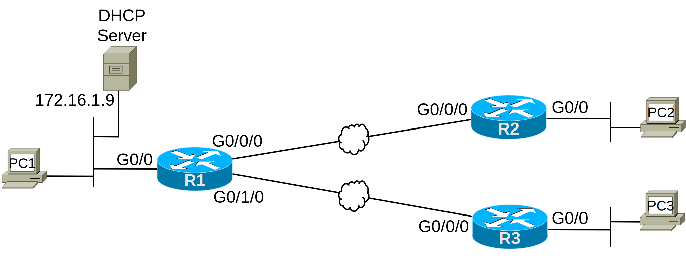

# [clab341](https://www.certskills.com/clab341/)

## Lab Requirements

This lab focuses on DHCP, specifically the DHCP Relay Agent feature of Cisco routers. To that end, the lab begins with all routers working for all features except DHCP Relay Agent. Specifically, all routers have IPv4 addresses configured on the interfaces shown in Figure 1, all running OSPF, and all learning all routes. If implemented, all routers would be able to ping all IP addresses on the other routers.

The lab also assumes that a DHCP Server is preconfigured. If you want to build this in your lab, you can, and you can even use a Cisco router as the DHCP server. The initial configurations below include the DHCP Server configuration on a router that would support this lab exercise. That configuration:

1. 1. Removes the first 100 addresses in each subnet from the DHCP pool so that the range of leased addresses begins with the fourth octet of .101.
    2. Sets the correct default gateway in each subnet.

The lab asks you to make the DHCP Clients work by deciding where to configure the DHCP Relay feature and then configuring that feature. The three PCs in the figure act as DHCP clients. The specific steps for this lab are as follows:

1. 1. Examine the initial configuration and topology while thinking about the DHCP Relay feature. Ask yourself:
        1. Should any DHCP Clients work without any DHCP Relay Agent configuration? If so, which ones?
        2. Do any DHCP Clients need the DHCP Relay Agent feature to work? If so, which ones?
        3. Plan your DHCP Relay Agent configuration.
    2. Once planned, create the DHCP Relay Agent configuration.
    3. If implementing in real gear, Cisco Packet Tracer, CML, or any other environment, check to ensure all three PCs lease an IP address.

#### 

#### Figure 1: Network for this Lab

## Initial Configuration

Examples 1, 2, and 3 show the initial IP addresses and OSPF configuration on the three routers. Note that none of the routers have any DHCP-related configuration.

    hostname R1
    !
    interface GigabitEthernet0/0
     ip address 172.16.1.1 255.255.255.0
    !
    interface GigabitEthernet0/0/0
     ip address 172.16.12.1 255.255.255.0
    !
    interface GigabitEthernet0/1/0
     ip address 172.16.13.1 255.255.255.0
    ! 
    router ospf 1
     network 0.0.0.0 255.255.255.255 area 0

#### Example 1: R1 Initial Configuration

    hostname R2
    !
    interface GigabitEthernet0/0
     ip address 172.16.2.2 255.255.255.0
    !
    interface GigabitEthernet0/0/0
     ip address 172.16.12.2 255.255.255.0
    !
    router ospf 1
     network 0.0.0.0 255.255.255.255 area 0

#### Example 2: R2 Initial Configuration

    hostname R3
    !
    interface GigabitEthernet0/0
     ip address 172.16.3.3 255.255.255.0
    !
    interface GigabitEthernet0/0/0
     ip address 172.16.13.3 255.255.255.0
    !
    router ospf 1
     network 0.0.0.0 255.255.255.255 area 0

#### Example 3: R3 Initial Configuration

Example 4 shows how you could configure a router to act as a DHCP server. However, you do NOT need to understand the configuration in Example 4 before doing this lab. In the example, the first few configuration lines give the router IP connectivity and enable OSPF to communicate. Most of the configuration creates the DHCP server.

    hostname DHCP-Server
    !
    interface GigabitEthernet0/0
     ip address 172.16.1.9 255.255.255.0
    !
    router ospf 1
     network 0.0.0.0 255.255.255.255 area 0
    !
    ip dhcp excluded-address 172.16.1.1 172.16.1.100
    ip dhcp excluded-address 172.16.2.1 172.16.2.100
    ip dhcp excluded-address 172.16.3.1 172.16.3.100
    !
    ip dhcp pool subnet1
     network 172.16.1.0 255.255.255.0
     dns-server 172.16.1.9
     default-router 172.16.1.1
     domain-name example.com
    !
    ip dhcp pool subnet2
     network 172.16.2.0 255.255.255.0
     dns-server 172.16.1.9
     default-router 172.16.2.2
     domain-name example.com
    !
    ip dhcp pool subnet3
     network 172.16.3.0 255.255.255.0
     dns-server 172.16.1.9
     default-router 172.16.3.3
     domain-name example.com

#### Example 4: Cisco Router as DHCP Server

## Answer Options - Click Tabs to Reveal

- Option 1: Paper/Editor
- Option 2: Cisco Packet Tracer
- Option 3: Cisco Modeling Labs

#### Option 1: Paper/Editor

You can learn a lot and strengthen real learning of the topics by creating the configuration – even without a router or switch CLI. In fact, these labs were originally built to be used solely as a paper exercise!

To answer, just think about the lab. Refer to your primary learning material for CCNA, your notes, and create the configuration on paper or in a text editor. Then check your answer versus the answer post, which is linked at the bottom of the lab, just above the comments section.

#### Option 2: Cisco Packet Tracer

You can also implement the lab using the Cisco Packet Tracer network simulator. With this option, you use Cisco’s free Packet Tracer simulator. You open a file that begins with the initial configuration already loaded. Then you implement your configuration and test to determine if it met the requirements of the lab.

[(Use this link for more information about Cisco Packet Tracer.](https://www.certskills.com/packettracer))

Use this workflow to do the labs in Cisco Packet Tracer:

1. Download the .pkt file linked below.
2. Open the .pkt file, creating a working lab with the same topology and interfaces as the lab exercise.
3. Add your planned configuration to the lab.
4. Test the configuration using some of the suggestions below.

[Download this lab’s Packet Tracer File](https://files.certskills.com/virl/clab341.pkt)

#### Option 3: Cisco Modeling Labs

You can also implement the lab using [Cisco Modeling Labs – Personal (CML-P)](https://developer.cisco.com/modeling-labs/). CML-P (or simply CML) replaced Cisco [Virtual Internet Routing Lab (VIRL)](https://virl.cisco.com/) software in 2020, in effect serving as VIRL Version 2.

If you prefer to use CML, use a similar workflow as you would use if using Cisco Packet Tracer, as follows:

1. Download the CML file (filetype .yaml) linked below.
2. Import the lab’s CML file into CML and then start the lab.
3. Compare the lab topology and interface IDs to this lab, as they may differ (more detail below).
4. Add your planned configuration to the lab.
5. Test the configuration using some of the suggestions below.

[Download this lab’s CML file!](https://files.certskills.com/virl/clab341.yaml)

#### Network Device Info:

This table lists the interfaces listed in the lab exercise documentation versus those used in the sample CML file.

| **Device** | **Lab Port** | **CML Port** |
| --- | --- | --- |
| SW1 | F0/1 | G0/0 |
| R1 | G0/0/0 | G0/2 |
| R1 | G0/1/0 | G0/3 |
| R2 | G0/0/0 | G0/1 |
| R3 | G0/0/0 | G0/1 |

# Lab Answers Below: Spoiler Alert