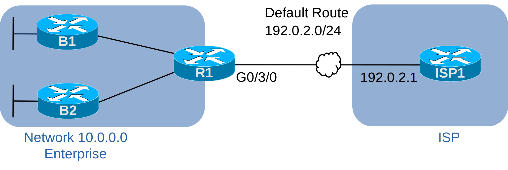

# [clab342](https://www.certskills.com/clab342/)

## Lab Requirements

One classic case for a router to lease an address with DHCP occurs with a router connected to an ISP. The link between the ISP router and the Enterprise router often uses public IP addresses as assigned by the ISP. As the customer, the Enterprise can ask to use statically assigned IP addresses on that link. However, in some cases, you can have the router dynamically learn its IP address on the ISP link using DHCP – much like a typical consumer router does at your home.

The Enterprise router also needs to create default routes to support traffic into the Internet. First, using DHCP, the router learns the ISP router’s IP address on the link. The router connected to that link can use that address as the next-hop IP address in a default route. Additionally, other routers may exist in the Enterprise site, like routers B1 and B2 in the figure. So, the Enterprise router connected to the ISP needs to advertise that it has a good default route to the rest of the routers. Then the other routers build their own default routes so that all Enterprise routers can forward packets towards the Internet.

#### Figure 1: Topology for this Lab

This lab begins with the three Enterprise routers (R1, B1, B2) with IP addresses configured inside the Enterprise and OSPF working on those links. The ISP is ready to use DHCP to assign R1 its IP address on its G0/3/0 interface. So, for this lab, your job:

1. Configure router R1 to use the DHCP client features:
    1. To lease its G0/3/0 IP address/mask.
    2. To build a default route based on the default gateway learned with DHCP.
2. Configure the Enterprise routers so that:
    1. All Enterprise routers build a default route that will forward packets towards the Internet (ISP1).

## Answer Options - Click Tabs to Reveal

- Option 1: Paper/Editor
- Option 2: Cisco Packet Tracer
- Option 3: Cisco Modeling Labs

#### Option 1: Paper/Editor

You can learn a lot and strengthen real learning of the topics by creating the configuration – even without a router or switch CLI. In fact, these labs were originally built to be used solely as a paper exercise!

To answer, just think about the lab. Refer to your primary learning material for CCNA, your notes, and create the configuration on paper or in a text editor. Then check your answer versus the answer post, which is linked at the bottom of the lab, just above the comments section.

#### Option 2: Cisco Packet Tracer

You can also implement the lab using the Cisco Packet Tracer network simulator. With this option, you use Cisco’s free Packet Tracer simulator. You open a file that begins with the initial configuration already loaded. Then you implement your configuration and test to determine if it met the requirements of the lab.

[(Use this link for more information about Cisco Packet Tracer.](https://www.certskills.com/packettracer))

Use this workflow to do the labs in Cisco Packet Tracer:

1. Download the .pkt file linked below.
2. Open the .pkt file, creating a working lab with the same topology and interfaces as the lab exercise.
3. Add your planned configuration to the lab.
4. Test the configuration using some of the suggestions below.

[Download this lab’s Packet Tracer File](https://files.certskills.com/virl/clab342.pkt)

#### Option 3: Cisco Modeling Labs

You can also implement the lab using [Cisco Modeling Labs – Personal (CML-P)](https://developer.cisco.com/modeling-labs/). CML-P (or simply CML) replaced Cisco [Virtual Internet Routing Lab (VIRL)](https://virl.cisco.com/) software in 2020, in effect serving as VIRL Version 2.

If you prefer to use CML, use a similar workflow as you would use if using Cisco Packet Tracer, as follows:

1. Download the CML file (filetype .yaml) linked below.
2. Import the lab’s CML file into CML and then start the lab.
3. Compare the lab topology and interface IDs to this lab, as they may differ (more detail below).
4. Add your planned configuration to the lab.
5. Test the configuration using some of the suggestions below.

[Download this lab’s CML file!](https://files.certskills.com/virl/clab342.yaml)

#### Network Device Info:

This table lists the interfaces listed in the lab exercise documentation versus those used in the sample CML file.

| **Device** | **Lab Port** | **CML Port** |
| --- | --- | --- |
| R1 | G0/0/0 | G0/0 |
| R1 | G0/1/0 | G0/1 |
| R1 | G0/3/0 | G0/3 |
| B1 | G0/1/0 | G0/1 |
| B2 | G0/0/0 | G0/1 |
| ISP1 | G0/00 | G0/0 |
| ISP1 | G0/0/0 | G0/0 |

####

# Lab Answers Below: Spoiler Alert