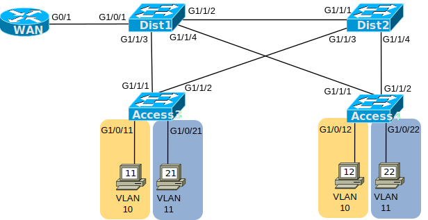

# [clab351](https://www.certskills.com/clab351/)

## Lab Requirements

This lab begins with a working network. It shows two PCs in each of the two separate VLANs/Subnets, with a router to router packets between the subnets. In fact, if you implement the lab as shown and use only the initial configuration, all the PCs should be able to ping each other.  In that case, STP/RSTP works with all default configuration settings.

(You may want to spend a little more time than usual checking out the detailed initial configuration. Also, if you plan to implement the lab for yourself in Cisco Packet Tracer or elsewhere, you may find it useful to implement the initial configuration and examine the VLANs, VLAN trunking, ROAS, and STP/RSTP behavior before performing the configuration.)

Once you understand the initial configuration, configure some common best practices for STP/RSTP in LANs. Specifically:

1. Use default STP/RSTP settings unless you need the setting to implement the lab.
2. Configure all switches to use per-vlan RSTP rather than per-vlan STP.
3. Root Switch in VLAN 10:
    1. Configure switch Dist1 with a better priority than the other switches so that Dist1 becomes the root switch.
    2. Configure the priority setting as a specific number.
    3. Use the highest priority setting possible for Dist1 while ensuring that Dist1 does not tie with the other switches.

Additionally, consider the following points about the switches’ choices for Designated Ports (DPs):

- After configuring so that Dist1 becomes the root switch in VLAN 10, but with all other STP/RSTP settings as defaults, all three switches will have a root cost of 4.
- As a result, the switches will tie in their Designated Port (DP) elections for the Dist2-Access3 and Dist2-Access4 links.
- As a result, the Designated Port (DP) choices on those links use tiebreakers.

Based on those facts, also configure to achieve the following goals:

1. Configure to avoid the tiebreakers for choosing any DPs by lowering the STP/RSTP port cost(s) on switch Dist2, in VLAN 10, on Dist2 port G1/1/1. (Such a change will change switch Dist2’s root cost.)
2. Multiple possible cost values could be used. However, for the purposes of this lab, set the cost to one lower than the default cost for a Gigabit Ethernet interface.

#### Figure 1: RSTP Topology for this Lab

## Initial Configuration

The four switches have no pre-configuration related to RSTP. However, all the switches use VLAN trunking on the links between switches. They also use VTP mode transparent, requiring the VLANs to be configured on each switch. So, each switch shows both VLAN 10 and 11 as preconfigured. For information about the PCs and the router, look below these next four examples.

    hostname Dist1
    !
    vtp mode transparent
    vlan 10,11
    !
    interface GigabitEthernet1/1/2
     description Trunk link to Dist2
     switchport mode trunk
    !
    interface GigabitEthernet1/1/3
     description Trunk link to Access3
     switchport mode trunk
    !
    interface GigabitEthernet1/1/4
     description Trunk link to Access4
     switchport mode trunk
    !
    interface GigabitEthernet1/0/1
     description Trunk to R1
     switchport mode trunk

#### Example 1: Dist1 Config

    hostname Dist2
    !
    vtp mode transparent
    vlan 10,11
    !
    interface GigabitEthernet1/1/1
     description Trunk link to Dist1
     switchport mode trunk
    !
    interface GigabitEthernet1/1/3
     description Trunk link to Access3
     switchport mode trunk
    !
    interface GigabitEthernet1/1/4
     description Trunk link to Access4
     switchport mode trunk

#### Example 2: Dist2 Config

    hostname Access3
    !
    vtp mode transparent
    vlan 10,11
    !
    interface GigabitEthernet1/1/1
     description Trunk link to Dist1
     switchport mode trunk
    !
    interface GigabitEthernet1/1/2
     description Trunk link to Dist2
     switchport mode trunk
    !
    interface GigabitEthernet1/0/11
     description Access link to PC11
     switchport mode access
     switchport access vlan 10
    !
    interface GigabitEthernet1/0/21
     description Access link to PC21
     switchport mode access
     switchport access vlan 11

#### Example 3: Access3 Config

    hostname Access4
    !
    vtp mode transparent
    vlan 10,11
    !
    interface GigabitEthernet1/1/1
     description Trunk link to Dist1
     switchport mode trunk
    !
    interface GigabitEthernet1/1/2
     description Trunk link to Dist2
     switchport mode trunk
    !
    interface GigabitEthernet1/0/12
     description Access link to PC12
     switchport mode access
     switchport access vlan 10
    !
    interface GigabitEthernet1/0/22
     description Access link to PC22
     switchport mode access
     switchport access vlan 11

#### Example 4: Access4 Config

The four PCs connect to two different access VLANs and subnets, as follows:

- PC11 and PC12: VLAN 10, subnet 10.1.10.0/24, gateway 10.1.10.1.
- PC21 and PC22: VLAN 11, subnet 10.1.11.0/24, gateway 10.1.11.1.

R1 uses a router-on-a-stick (ROAS) configuration to support the subnets. With the initial topology and device configurations, the PCs should be able to ping each other and the default gateway. Their initial configurations are shown next.

    Address: 10.1.10.11
    Mask: 255.255.255.0
    Gateway: 10.1.10.1

#### Example 5: PC11 Configuration Settings

#### 

    Address: 10.1.10.12
    Mask: 255.255.255.0
    Gateway: 10.1.10.1

#### Example 6: PC12 Configuration Settings

#### 

    Address: 10.1.11.21
    Mask: 255.255.255.0
    Gateway: 10.1.11.1

#### Example 7: PC21 Configuration Settings

#### 

    Address: 10.1.11.22
    Mask: 255.255.255.0
    Gateway: 10.1.11.1

#### Example 8: PC22 Configuration Settings

    hostname WAN
    !
    interface gigabitethernet0/1
     no shutdown
    !
    interface gigabitethernet0/1.10
     encapsulation dot1q 10
     ip address 10.1.10.1 255.255.255.0
    !
    interface gigabitethernet0/1.11
     encapsulation dot1q 11
     ip address 10.1.11.1 255.255.255.0

#### Example 9: Router R1 Configuration Settings

Finally, you can proceed with the lab based on the above introduction. However, if you want a little different take about the scenario for this lab, check out this video:

<iframe title="YouTube video player" src="https://www.youtube.com/embed/CMp0gLw_V6s?si=_dreuvaITUGu2MgL" width="560" height="315" frameborder="0" allowfullscreen="allowfullscreen"></iframe>

## Answer Options - Click Tabs to Reveal

- Option 1: Paper/Editor
- Option 2: Cisco Packet Tracer
- Option 3: Cisco Modeling Labs

#### Option 1: Paper/Editor

You can learn a lot and strengthen real learning of the topics by creating the configuration – even without a router or switch CLI. In fact, these labs were originally built to be used solely as a paper exercise!

To answer, just think about the lab. Refer to your primary learning material for CCNA, your notes, and create the configuration on paper or in a text editor. Then check your answer versus the answer post, which is linked at the bottom of the lab, just above the comments section.

#### Option 2: Cisco Packet Tracer

You can also implement the lab using the Cisco Packet Tracer network simulator. With this option, you use Cisco’s free Packet Tracer simulator. You open a file that begins with the initial configuration already loaded. Then you implement your configuration and test to determine if it met the requirements of the lab.

[(Use this link for more information about Cisco Packet Tracer.](https://www.certskills.com/packettracer))

Use this workflow to do the labs in Cisco Packet Tracer:

1. Download the .pkt file linked below.
2. Open the .pkt file, creating a working lab with the same topology and interfaces as the lab exercise.
3. Add your planned configuration to the lab.
4. Test the configuration using some of the suggestions below.

[Download this lab’s Packet Tracer File](https://files.certskills.com/virl/clab351.pkt)

#### Option 3: Cisco Modeling Labs

## This Lab Supports Both CML-Free and CML-Personal!!!

The downloadable file listed here works in both CML-P or CML-F because it uses the IOL (router) and IOL-L2 (switch) reference platform images supported by both products as of CML V2.8. Note that these images also require less CPU and RAM than the other CML-P options.

Use the same general workflow as with Cisco Packet Tracer, as follows:

1. Download the CML file (filetype .yaml) linked below.
2. Import the lab’s CML file into CML.
3. Start the lab in CML.
4. Compare the CML lab topology and interface IDs to this lab Blog page, as they may differ (more detail below).
5. Add your planned configuration to the lab, adjusting for interface ID differences.
6. Test the configuration using some of the suggestions below.

[Download this lab’s CML file!](https://files.certskills.com/virl/clab351-free.yaml)

#### Interface ID Differences:

The lab diagrams on this page use interface IDs (IIDs) that match the Packet Tracer version of the lab. When using CML, adjust the lab IIDs based on this table. Also, note that the IOL and IOL-L2 images used by the supplied CML file support only the “Ethernet” interface type, and not “FastEthernet” or “GigabitEthernet”.

The conventions for this lab are:

- All Gigabit interface types become Ethernet.
- All Gigabit interface numbers in the pattern G1/1/x become E0/x (with two exceptions):
    - The two exceptions: The two interfaces G1/1/4 become E0/0.
- Two interfaces do not follow the G1/1/x pattern: The interfaces on the link between router R1 and switch Dist1. Use E0/1 for the IID on both ends of that link.

| **Port Shown in Lab** | **CML Port** |
| --- | --- |
| G1/1/1 | E0/1 |
| G1/1/2 | E0/2 |
| G1/1/3 | E0/3 |
| G1/1/**4** | E0/**0** |
| G1/0/**1** | E0/**1** |
| G0/**1** | E0/**1** |

# Lab Answers Below: Spoiler Alert

---

## Lab Answers

    spanning-tree mode rapid-pvst
    spanning-tree vlan 10 priority 28672

#### Example: Dist1 Config

    spanning-tree mode rapid-pvst
    interface GigabitEthernet1/1/1
     spanning-tree vlan 10 cost 3

#### Example: Dist2 Config

    spanning-tree mode rapid-pvst

#### Example: Access3 Config

    spanning-tree mode rapid-pvst

#### Example: Access4 Config