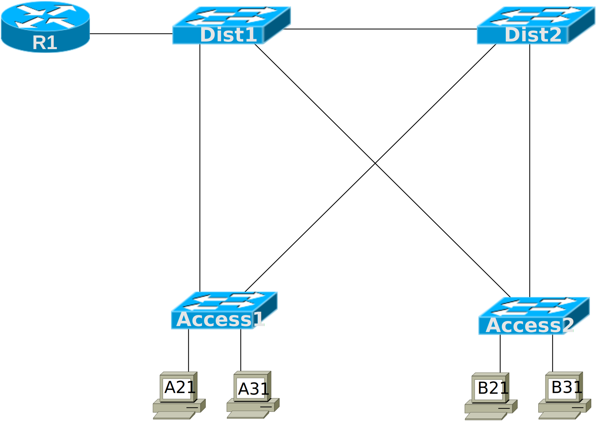

# [clab353](https://www.certskills.com/clab353/)

## Initial Configuration

Examples 1, 2, 3, and 4 show the beginning configuration state of Dist1, Dist2, Access1, and Access2.

    hostname Dist1
    !
    interface GigabitEthernet1/0/1
      description Trunk to R1
      switchport mode trunk

#### Example 1: Dist1 Config

    hostname Dist2

#### Example 2: Dist2 Config

    hostname Access1

#### Example 3: Access1 Config

    hostname Access2

#### Example 4: Access2 Config

As a reminder, router R1 is pre-configured correctly to route between two subnets. You should not need to configure the router.

    hostname R1
    !
    interface GigabitEthernet0/1
      no ip address
    !
    interface GigabitEthernet0/1.21
      encapsulation dot1Q 21
      ip address 10.1.21.254 255.255.255.0
    !
    interface GigabitEthernet0/1.31
      encapsulation dot1Q 31
      ip address 10.1.31.254 255.255.255.0

#### Example 5: R1 Config

### Config Lab Intro Video

<iframe id="iframe-player-10" data-id="10" class="youtube-player" width="1140" height="642" src="https://www.youtube.com/embed/RX2YzW7CayU?version=3&#038;rel=1&#038;showsearch=0&#038;showinfo=1&#038;iv_load_policy=1&#038;fs=1&#038;hl=en-US&#038;autohide=2&#038;wmode=transparent" allowfullscreen="true" style="border:0;" sandbox="allow-scripts allow-same-origin allow-popups allow-presentation allow-popups-to-escape-sandbox"></iframe>

The above lab intro – the text, figures, and initial configuration – tells you all you need to know. But if you want a little more, with a little different slant on what to do in this lab, watch this lab intro video!

## Answer Options - Click Tabs to Reveal

- Option 1: Paper/Editor
- Option 2: Cisco Packet Tracer

#### Option 1: Paper/Editor

You can learn a lot and strengthen real learning of the topics by creating the configuration – even without a router or switch CLI. In fact, these labs were originally built to be used solely as a paper exercise!

To answer, just think about the lab. Refer to your primary learning material for CCNA, your notes, and create the configuration on paper or in a text editor. Then check your answer versus the answer post, which is linked at the bottom of the lab, just above the comments section.

#### Option 2: Cisco Packet Tracer

You can also implement the lab using the Cisco Packet Tracer network simulator. With this option, you use Cisco’s free Packet Tracer simulator. You open a file that begins with the initial configuration already loaded. Then you implement your configuration and test to determine if it met the requirements of the lab.

[(Use this link for more information about Cisco Packet Tracer.](https://www.certskills.com/packettracer))

Use this workflow to do the labs in Cisco Packet Tracer:

1. Download the .pkt file linked below.
2. Open the .pkt file, creating a working lab with the same topology and interfaces as the lab exercise.
3. Add your planned configuration to the lab.
4. Test the configuration using some of the suggestions below.

[Download this lab’s Packet Tracer File](https://files.certskills.com/virl/clab353.pkt)

# Lab Answers Below: Spoiler Alert

---

## Answers

#### Figure 1: Four Switches with Trunks

    vtp mode transparent
    !
    vlan 21
    vlan 31
    !
    spanning-tree mode rapid-pvst
    spanning-tree vlan 21 root primary
    spanning-tree vlan 31 root secondary
    !
    ! Next interface connects to router R1
    interface GigabitEthernet1/0/1
      description R1 G0/1 is the neighbor
      switchport trunk allowed vlan 21,31
    !
    interface GigabitEthernet1/1/1
      description Dist2 G1/1/2 is the neighbor
      channel-group 3 mode active
      switchport mode trunk
      switchport trunk allowed vlan 21,31
    !
    interface GigabitEthernet1/1/2
      description Dist2 G1/1/1 is the neighbor
      channel-group 3 mode active
      switchport mode trunk
      switchport trunk allowed vlan 21,31
    !
    ! Note: Port-Channel3 created due to earlier channel-group commands
    interface Port-Channel3
      switchport mode trunk
      switchport trunk allowed vlan 21,31
    !
    interface GigabitEthernet1/1/3
      description Access1 G1/1/1 is the neighbor
      switchport mode dynamic desirable
      switchport trunk allowed vlan 21,31
    !
    interface GigabitEthernet1/1/4
      description Access2 G1/1/1 is the neighbor
      switchport mode dynamic desirable
      switchport trunk allowed vlan 21,31

#### Example 5: Dist1 Config

    vtp mode transparent
    !
    vlan 21
    vlan 31
    !
    spanning-tree mode rapid-pvst
    spanning-tree vlan 21 root secondary
    spanning-tree vlan 31 root primary
    !
    interface GigabitEthernet1/1/1
      description Dist1 G1/1/2 is the neighbor
      channel-group 3 mode active
      switchport mode trunk
      switchport trunk allowed vlan 21,31
    !
    interface GigabitEthernet1/1/2
      description Dist1 G1/1/1 is the neighbor
      channel-group 3 mode active
      switchport mode trunk
      switchport trunk allowed vlan 21,31
    !
    ! Note: Port-Channel3 created due to earlier channel-group commands
    interface Port-Channel3
      switchport mode trunk
      switchport trunk allowed vlan 21,31
    !
    interface GigabitEthernet1/1/3
      description Access1 G1/1/2 is the neighbor
      switchport mode trunk
      switchport trunk allowed vlan 21,31
    !
    interface GigabitEthernet1/1/4
      description Access2 G1/1/2 is the neighbor
      switchport mode trunk
      switchport trunk allowed vlan 21,31

#### Example 6: Dist2 Config

    vtp mode transparent
    !
    vlan 21
    vlan 31
    !
    interface GigabitEthernet1/0/11
      switchport mode access
      switchport access vlan 21
      spanning-tree portfast
      spanning-tree bpduguard enable
    !
    interface GigabitEthernet1/0/21
      switchport mode access
      switchport access vlan 31
      spanning-tree portfast
      spanning-tree bpduguard enable
    !
    interface GigabitEthernet1/1/1
      description Dist1 G1/1/3 is the neighbor
      switchport mode dynamic desirable
      switchport trunk allowed vlan 21,31
    !
    interface GigabitEthernet1/1/2
      description Dist2 G1/1/3 is the neighbor
      switchport mode dynamic desirable
      switchport trunk allowed vlan 21,31

#### Example 7: Access1 Config

    vtp mode transparent
    !
    vlan 21
    vlan 31
    !
    interface GigabitEthernet1/0/12
      switchport mode access
      switchport access vlan 21
      spanning-tree portfast
      spanning-tree bpduguard enable
    !
    interface GigabitEthernet1/0/22
      switchport mode access
      switchport access vlan 31
      spanning-tree portfast
      spanning-tree bpduguard enable
    !
    interface GigabitEthernet1/1/1
      description Dist1 G1/1/4 is the neighbor
      switchport mode dynamic auto
      switchport trunk allowed vlan 21,31
    !
    interface GigabitEthernet1/1/2
      description Dist2 G1/1/4 is the neighbor
      switchport mode dynamic auto
      switchport trunk allowed vlan 21,31

#### Example 8: Access2 Config