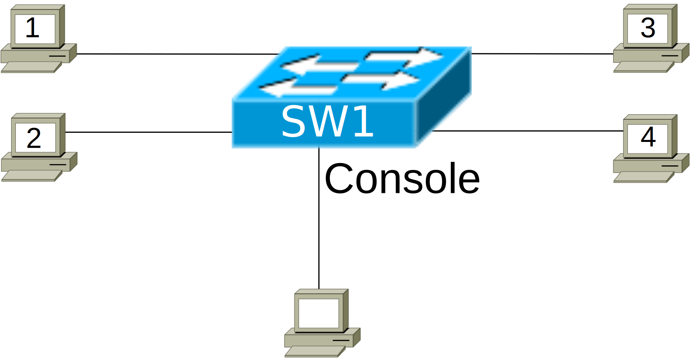

# [clab402](https://www.certskills.com/clab402/)

## Initial Configuration

The switch does have some initial configuration: It has been configured with the **hostname SW1** command. As a result, the command prompt begins with “SW1” instead of the default of “switch”.