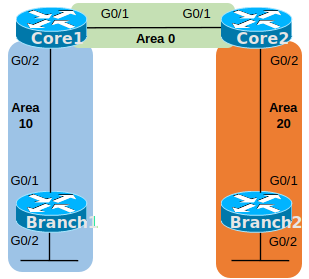

# [clab551](https://www.certskills.com/clab551/)

## Initial Configuration

Example 1, 2, 3 and 4 show the beginning configuration state of Core1, Core2, Branch1 and Branch2.

    hostname Core1
    !
    interface GigabitEthernet0/1
     ip address 100.100.100.1 255.255.255.252
     no shutdown
    !
    interface GigabitEthernet0/2
     ip address 100.100.100.129 255.255.255.192
     no shutdown

#### Example 1: Core1 Config

    hostname Core2
    !
    interface GigabitEthernet0/1
     ip address 100.100.100.2 255.255.255.252
     no shutdown
    !
    interface GigabitEthernet0/2
     ip address 100.100.100.193 255.255.255.192
     no shutdown

#### Example 2: Core2 Config

    hostname Branch1
    !
    interface GigabitEthernet0/1
     ip address 100.100.100.130 255.255.255.192
     no shutdown
    !
    interface GigabitEthernet0/2
     ip address 100.100.101.126 255.255.255.128
     no shutdown

#### Example 3: Branch1 Config

    hostname Branch2
    !
    interface GigabitEthernet0/1
     ip address 100.100.100.194 255.255.255.192
     no shutdown
    !
    interface GigabitEthernet0/2
     ip address 100.100.101.254 255.255.255.128
     no shutdown

#### Example 4: Branch2 Config

## Answer Options - Click Tabs to Reveal

- Option 1: Paper/Editor
- Option 2: Cisco Packet Tracer
- Option 3: Cisco Modeling Labs

#### Option 1: Paper/Editor

You can learn a lot and strengthen real learning of the topics by creating the configuration – even without a router or switch CLI. In fact, these labs were originally built to be used solely as a paper exercise!

To answer, just think about the lab. Refer to your primary learning material for CCNA, your notes, and create the configuration on paper or in a text editor. Then check your answer versus the answer post, which is linked at the bottom of the lab, just above the comments section.

#### Option 2: Cisco Packet Tracer

You can also implement the lab using the Cisco Packet Tracer network simulator. With this option, you use Cisco’s free Packet Tracer simulator. You open a file that begins with the initial configuration already loaded. Then you implement your configuration and test to determine if it met the requirements of the lab.

[(Use this link for more information about Cisco Packet Tracer.](https://www.certskills.com/packettracer))

Use this workflow to do the labs in Cisco Packet Tracer:

1. Download the .pkt file linked below.
2. Open the .pkt file, creating a working lab with the same topology and interfaces as the lab exercise.
3. Add your planned configuration to the lab.
4. Test the configuration using some of the suggestions below.

[Download this lab’s Packet Tracer File](https://files.certskills.com/virl/clab551.pkt)

#### Option 3: Cisco Modeling Labs

You can also implement the lab using [Cisco Modeling Labs – Personal (CML-P)](https://developer.cisco.com/modeling-labs/). CML-P (or simply CML) replaced Cisco [Virtual Internet Routing Lab (VIRL)](https://virl.cisco.com/) software in 2020, in effect serving as VIRL Version 2.

If you prefer to use CML, use a similar workflow as you would use if using Cisco Packet Tracer, as follows:

1. Download the CML file (filetype .yaml) linked below.
2. Import the lab’s CML file into CML and then start the lab.
3. Compare the lab topology and interface IDs to this lab, as they may differ (more detail below).
4. Add your planned configuration to the lab.
5. Test the configuration using some of the suggestions below.

[Download this lab’s CML file!](https://files.certskills.com/virl/clab551.yaml)

#### Network Device Info:

The CML topology matches this lab topology.

# Lab Answers Below: Spoiler Alert

---

## Answers

#### Figure 1: Multi-area OSPF Topology

    router ospf 10
     router-id 1.1.1.1
     network 100.100.100.0 0.0.0.3 area 0
     network 100.100.100.128 0.0.0.63 area 10

#### Example 1: Core1 Config

    router ospf 10
     router-id 2.2.2.2
     network 100.100.100.0 0.0.0.3 area 0
     network 100.100.100.192 0.0.0.63 area 20

#### Example 2: Core2 Config

    router ospf 10
     router-id 10.10.10.10
     network 100.100.100.128 0.0.0.63 area 10
     network 100.100.101.0 0.0.0.127 area 10

#### Example 3: Branch1 Config

    router ospf 10
     router-id 20.20.20.20
     network 100.100.100.192 0.0.0.63 area 20
     network 100.100.101.128 0.0.0.127 area 20

#### Example 4: Branch2 Config