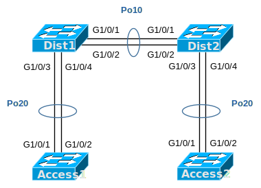

# [clab555](https://www.certskills.com/clab555/)

## Initial Configuration

Examples 1, 2, 3, and 4 show the beginning configuration state of Dist1, Dist2, Access1, and Access2.

    hostname Dist1
    !
    vlan 2,3,4
    !
    interface GigabitEthernet1/0/1
     switchport trunk encapsulation dot1q
     switchport mode dynamic desirable
     channel-group 10 mode on
    !
    interface GigabitEthernet1/0/2
     switchport access vlan 2
     switchport trunk encapsulation dot1q
     switchport mode dynamic desirable
     channel-group 10 mode on
    !
    interface GigabitEthernet1/0/3
     switchport trunk encapsulation dot1q
     switchport mode dynamic desirable
     channel-group 20 mode active
    !
    interface GigabitEthernet1/0/4
     switchport trunk encapsulation dot1q
     switchport mode dynamic desirable
     channel-group 20 mode active

#### Example 1: Dist1 Config

    hostname Dist2
    !
    vlan 2,3,4
    !
    interface GigabitEthernet1/0/1
     switchport trunk encapsulation dot1q
     switchport mode dynamic desirable
     channel-group 10 mode on
    !
    interface GigabitEthernet1/0/2
     switchport trunk encapsulation dot1q
     switchport mode dynamic desirable
     switchport access vlan 2
     channel-group 10 mode on
    !
    interface GigabitEthernet1/0/3
     switchport trunk encapsulation dot1q
     switchport mode dynamic desirable
     channel-group 20 mode auto
    !
    interface GigabitEthernet1/0/4
     switchport trunk encapsulation dot1q
     switchport mode dynamic desirable
     switchport access vlan 2
     channel-group 20 mode auto

#### Example 2: Dist2 Config

    hostname Access1
    !
    vlan 2,3,4
    !
    interface GigabitEthernet1/0/1
     switchport trunk encapsulation dot1q
     switchport mode dynamic desirable
     channel-group 20 mode desirable
    !
    interface GigabitEthernet1/0/2
     switchport trunk encapsulation dot1q
     switchport mode dynamic desirable
     channel-group 20 mode desirable

#### Example 3: Access1 Config

    hostname Access2
    !
    vlan 2,3,4
    !
    interface GigabitEthernet1/0/1
     switchport trunk encapsulation dot1q
     switchport mode dynamic desirable
     channel-group 20 mode auto
    !
    interface GigabitEthernet1/0/2
     switchport trunk encapsulation dot1q
     switchport mode dynamic desirable
     switchport access vlan 2
     channel-group 20 mode auto

#### Example 4: Access2 Config

## Answer Options - Click Tabs to Reveal

- Option 1: Paper/Editor
- Option 2: Cisco Packet Tracer
- Option 3: Cisco Modeling Labs

#### Option 1: Paper/Editor

You can learn a lot and strengthen real learning of the topics by creating the configuration – even without a router or switch CLI. In fact, these labs were originally built to be used solely as a paper exercise!

To answer, just think about the lab. Refer to your primary learning material for CCNA, your notes, and create the configuration on paper or in a text editor. Then check your answer versus the answer post, which is linked at the bottom of the lab, just above the comments section.

#### Option 2: Cisco Packet Tracer

You can also implement the lab using the Cisco Packet Tracer network simulator. With this option, you use Cisco’s free Packet Tracer simulator. You open a file that begins with the initial configuration already loaded. Then you implement your configuration and test to determine if it met the requirements of the lab.

[(Use this link for more information about Cisco Packet Tracer.](https://www.certskills.com/packettracer))

Use this workflow to do the labs in Cisco Packet Tracer:

1. Download the .pkt file linked below.
2. Open the .pkt file, creating a working lab with the same topology and interfaces as the lab exercise.
3. Add your planned configuration to the lab.
4. Test the configuration using some of the suggestions below.

[Download this lab’s Packet Tracer File](https://files.certskills.com/virl/clab555.pkt)

#### Option 3: Cisco Modeling Labs

You can also implement the lab using [Cisco Modeling Labs – Personal (CML-P)](https://developer.cisco.com/modeling-labs/). CML-P (or simply CML) replaced Cisco [Virtual Internet Routing Lab (VIRL)](https://virl.cisco.com/) software in 2020, in effect serving as VIRL Version 2.

If you prefer to use CML, use a similar workflow as you would use if using Cisco Packet Tracer, as follows:

1. Download the CML file (filetype .yaml) linked below.
2. Import the lab’s CML file into CML and then start the lab.
3. Compare the lab topology and interface IDs to this lab, as they may differ (more detail below).
4. Add your planned configuration to the lab.
5. Test the configuration using some of the suggestions below.

[Download this lab’s CML file!](https://files.certskills.com/virl/clab555.yaml)

Note: As of when this post was published, CML did not support LACP to negotiate a trunk. The LACP configuration shown in the answers post is correct, but if you test in CML, you will not see a working EtherChannel between Dist1 and Access1.

Note: IOS tends to copy interface configuration over to the automatically-creates port-channel interface, and for good reason. However, that feature means that in your lab, or when using CML, you may see a slightly different initial configuration based on the timing of when the configuration is added to the switches. So, if you do this lab in CML or any other environment, focus more on the final configuration rather than the interim state or the initial configuration state.

#### Network Device Info:

This table lists the interfaces listed in the lab exercise documentation versus those used in the sample CML file.

| **Device** | **Lab Port** | **CML Port** |
| --- | --- | --- |
| Dist1 | G1/0/1 | G0/1 |
| Dist1 | G1/0/2 | G0/2 |
| Dist1 | G1/0/3 | G0/3 |
| Dist1 | G1/0/4 | G1/0 |
| Dist2 | G1/0/1 | G0/1 |
| Dist2 | G1/0/2 | G0/2 |
| Dist2 | G1/0/3 | G0/3 |
| Dist2 | G1/0/4 | G1/0 |
| Access1 | G1/0/1 | G0/1 |
| Access1 | G1/0/2 | G0/2 |
| Access2 | G1/0/1 | G0/1 |
| Access2 | G1/0/2 | G0/2 |

# Lab Answers Below: Spoiler Alert

---

## Answers

#### Figure 1: Distribution/Access Switch Topology

    interface GigabitEthernet1/0/2
     no switchport access vlan 2
    ! 
    interface port-channel 10
     switchport trunk encapsulation dot1q
     switchport mode dynamic desirable
    ! 
    interface port-channel 20
     switchport trunk encapsulation dot1q
     switchport mode dynamic desirable

#### Example 1: Dist1 Config

    interface GigabitEthernet1/0/2
     no switchport access vlan 2
    !
    interface GigabitEthernet1/0/3
     shutdown
     channel-group 20 mode desirable
     no shutdown
    !
    interface GigabitEthernet1/0/4
     shutdown
     channel-group 20 mode desirable
     no shutdown
    ! 
    interface port-channel 10
     switchport trunk encapsulation dot1q
     switchport mode dynamic desirable
    ! 
    interface port-channel 20
     switchport trunk encapsulation dot1q
     switchport mode dynamic desirable

#### Example 2: Dist2 Config

    interface range GigabitEthernet1/0/1-2
     shutdown
     no channel-group 20 mode desirable
     channel-group 20 mode passive
     no shutdown
    ! 
    interface port-channel 20
     switchport trunk encapsulation dot1q
     switchport mode dynamic desirable

#### Example 3: Access1 Config

    interface port-channel 20
     switchport trunk encapsulation dot1q
     switchport mode dynamic desirable

#### Example 4: Access2 Config